<div class="MCWHeader1">
Security baseline on Azure
</div>

<div class="MCWHeader2">
Hands-on lab step-by-step
</div>

<div class="MCWHeader3">
July 2020
</div>

Information in this document, including URL and other Internet Web site references, is subject to change without notice. Unless otherwise noted, the example companies, organizations, products, domain names, e-mail addresses, logos, people, places, and events depicted herein are fictitious, and no association with any real company, organization, product, domain name, e-mail address, logo, person, place or event is intended or should be inferred. Complying with all applicable copyright laws is the responsibility of the user. Without limiting the rights under copyright, no part of this document may be reproduced, stored in or introduced into a retrieval system, or transmitted in any form or by any means (electronic, mechanical, photocopying, recording, or otherwise), or for any purpose, without the express written permission of Microsoft Corporation.

Microsoft may have patents, patent applications, trademarks, copyrights, or other intellectual property rights covering subject matter in this document. Except as expressly provided in any written license agreement from Microsoft, the furnishing of this document does not give you any license to these patents, trademarks, copyrights, or other intellectual property.

The names of manufacturers, products, or URLs are provided for informational purposes only, and Microsoft makes no representations and warranties, either expressed, implied, or statutory, regarding these manufacturers or the use of the products with any Microsoft technologies. The inclusion of a manufacturer or product does not imply endorsement of Microsoft of the manufacturer or product. Links may be provided to third-party sites. Such sites are not under the control of Microsoft and Microsoft is not responsible for the contents of any linked site or any link contained in a linked site, or any changes or updates to such sites. Microsoft is not responsible for webcasting or any other form of transmission received from any linked site. Microsoft is providing these links to you only as a convenience, and the inclusion of any link does not imply endorsement of Microsoft of the site or the products contained therein.

© 2020 Microsoft Corporation. All rights reserved.

Microsoft and the trademarks listed at <https://www.microsoft.com/en-us/legal/intellectualproperty/Trademarks/Usage/General.aspx> are trademarks of the Microsoft group of companies. All other trademarks are the property of their respective owners.

**Contents**


- [Security baseline on Azure hands-on lab step-by-step](#security-baseline-on-azure-hands-on-lab-step-by-step)
  - [Abstract and learning objectives](#abstract-and-learning-objectives)
  - [Overview](#overview)
  - [Solution architecture](#solution-architecture)
  - [Requirements](#requirements)
  - [Exercise 1: Implementing Just-in-Time (JIT) access](#exercise-1-implementing-just-in-time-jit-access)
    - [Task 1: Setup virtual machine with JIT](#task-1-setup-virtual-machine-with-jit)
    - [Task 2: Perform a JIT request](#task-2-perform-a-jit-request)
  - [Exercise 2: Securing the Web Application and database](#exercise-2-securing-the-web-application-and-database)
    - [Task 1: Setup the database](#task-1-setup-the-database)
    - [Task 2: Test the web application solution](#task-2-test-the-web-application-solution)
    - [Task 3: Utilize data masking](#task-3-utilize-data-masking)
    - [Task 4: Utilize column encryption with Azure Key Vault](#task-4-utilize-column-encryption-with-azure-key-vault)
  - [Exercise 3: Migrating to Azure Key Vault](#exercise-3-migrating-to-azure-key-vault)
    - [Task 1: Create an Azure Key Vault secret](#task-1-create-an-azure-key-vault-secret)
    - [Task 2: Create an Azure Active Directory application](#task-2-create-an-azure-active-directory-application)
    - [Task 3: Assign Azure Active Directory application permissions](#task-3-assign-azure-active-directory-application-permissions)
    - [Task 4: Install or verify NuGet Package](#task-4-install-or-verify-nuget-package)
    - [Task 5: Test the solution](#task-5-test-the-solution)
  - [Exercise 4: Securing the network](#exercise-4-securing-the-network)
    - [Task 1: Test network security group rules \#1](#task-1-test-network-security-group-rules-1)
    - [Task 2: Configure network security groups](#task-2-configure-network-security-groups)
    - [Task 3: Test network security group rules \#2](#task-3-test-network-security-group-rules-2)
    - [Task 4: Install network watcher VM extension](#task-4-install-network-watcher-vm-extension)
    - [Task 5: Setup network packet capture](#task-5-setup-network-packet-capture)
    - [Task 6: Execute a port scan](#task-6-execute-a-port-scan)
  - [Exercise 5: Azure Security Center](#exercise-5-azure-security-center)
    - [Task 1: Linux VM and Microsoft Monitoring Agent (MMA) install](#task-1-linux-vm-and-microsoft-monitoring-agent-mma-install)
    - [Task 2: Execute brute force attack](#task-2-execute-brute-force-attack)
    - [Task 3: Enable change tracking and update management](#task-3-enable-change-tracking-and-update-management)
    - [Task 4: Review MMA configuration](#task-4-review-mma-configuration)
    - [Task 5: Adaptive Application Controls](#task-5-adaptive-application-controls)
    - [Task 6: File Integrity Monitoring](#task-6-file-integrity-monitoring)
    - [Task 7: Disk encryption](#task-7-disk-encryption)
  - [Exercise 6: Azure Sentinel logging and reporting](#exercise-6-azure-sentinel-logging-and-reporting)
    - [Task 1: Create a dashboard](#task-1-create-a-dashboard)
    - [Task 2: Create an Analytics alert](#task-2-create-an-analytics-alert)
    - [Task 3: Investigate a custom alert incident](#task-3-investigate-a-custom-alert-incident)
    - [Task 4: Create and run a playbook](#task-4-create-and-run-a-playbook)
    - [Task 5: Execute Jupyter Notebooks](#task-5-execute-jupyter-notebooks)
    - [Task 6: Creating reports with Power BI](#task-6-creating-reports-with-power-bi)
  - [Exercise 7: Using Compliance Tools (Azure Policy, Secure Score and Compliance Manager)](#exercise-7-using-compliance-tools-azure-policy-secure-score-and-compliance-manager)
    - [Task 1: Review a basic Azure Policy](#task-1-review-a-basic-azure-policy)
    - [Task 2: Review and create Azure Blueprints](#task-2-review-and-create-azure-blueprints)
    - [Task 3: Secure Score](#task-3-secure-score)
    - [Task 4: Use Compliance Manager for Azure](#task-4-use-compliance-manager-for-azure)
  - [After the hands-on lab](#after-the-hands-on-lab)
    - [Task 1: Delete resource group](#task-1-delete-resource-group)
    - [Task 2: Remove Standard Tier Pricing](#task-2-remove-standard-tier-pricing)
    - [Task 3: Delete lab environment (optional)](#task-3-delete-lab-environment-optional)


# Security baseline on Azure hands-on lab step-by-step

## Abstract and learning objectives

In this hands-on lab, you will implement many of the Azure Security Center features to secure their cloud-based Azure infrastructure (IaaS) and applications (PaaS). Specifically, you will ensure that any internet exposed resources have been properly secured and any non-required internet access disabled. Additionally, you will implement a “jump machine” for administrators with Application Security enabled to prevent those same administrators from installing non-approved software and potentially exposing cloud resources. You will then utilize custom alerts to monitor for TCP/IP Port Scans to fire alerts.

At the end of this hands-on lab, you will be better able to design and build secure cloud-based architectures, and to improve the security of existing applications hosted within Azure.

## Overview

Contoso is a multinational corporation, headquartered in the United States that provides insurance solutions worldwide. Its products include accident and health insurance, life insurance, travel, home, and auto coverage. Contoso manages data collection services by sending mobile agents directly to the insured to gather information as part of the data collection process for claims from an insured individual. These mobile agents are based all over the world and are residents of the region in which they work. Mobile agents are managed remotely, and each regional corporate office has a support staff responsible for scheduling their time based on requests that arrive to the system.

They are migrating many of their applications via Lift and Shift to Azure and would like to ensure that they can implement the same type of security controls and mechanisms they currently have. They would like to be able to demonstrate their ability to meet compliance guidelines required in the various countries/regions they do business. They have already migrated a web application and database server to their Azure instance and would like to enable various logging and security best practices for administrator logins, SQL Databases, and virtual network design.

## Solution architecture

Contoso administrators recently learned about the Azure Security Center and have decided to implement many of its features to secure their cloud-based Azure infrastructure (IaaS) and applications (PaaS). Specifically, they want to ensure that any internet exposed resources have been property secured and any non-required internet access disabled. They also decided that implementing a "jump machine" for admins with Application Security was also important as they have had instances of admins installing non-approved software on their machines and then accessing cloud resources. Additionally, they want the ability to be alerted when TCP/IP Port Scans are detected, and fire alerts based on those attacks.

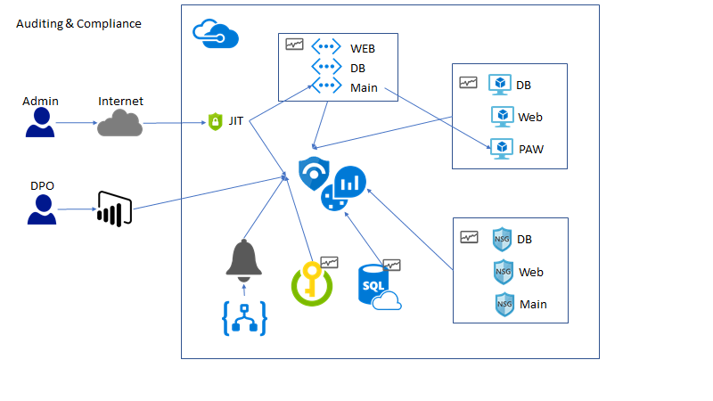

The solution begins by creating a jump machine. This jump machine is used to access the virtual machines and other resources in the resource group. All other access is disabled via multiple **virtual networks**. More than one virtual network is required as having a single **virtual network** would cause all resource to be accessible based on the default currently un-customizable security group rules. Resources are organized into these virtual networks. **Azure Center Security** is utilized to do **Just-In-Time** access to the jump machine. This ensures that all access is audited to the jump machine and that only authorized IP-addressed are allowed access, this prevents random attacks on the virtual machines from bad internet actors. Additionally, applications are not allowed to be installed on the jump machine to ensure that malware never becomes an issue. Each of the virtual network and corresponding **network security groups** have logging enabled to record deny events to **Azure Logging**. These events are then monitored by a **custom alert rule** in **Azure Sentinel** to fire **custom alerts**. Once the solution is in place, the **Compliance Manager** tool is utilized to ensure that all GDPR based technical and business controls are implemented and maintained to ensure GDPR compliance.

## Requirements

1. Microsoft Azure subscription must be pay-as-you-go or MSDN.

    - Trial subscriptions will not work.

2. A machine with the following software installed:

    - Visual Studio 2019
    - SQL Management Studio
    - Power BI Desktop

## Exercise 1: Implementing Just-in-Time (JIT) access

Duration: 15 minutes

In this exercise, attendees will secure a Privileged Access Workstation (PAW) workstation using the Azure Security Center Just-in-Time Access feature.

### Task 1: Setup virtual machine with JIT

1. In a browser, navigate to your Azure portal (<https://portal.azure.com>).

2. Select **Security Center,** then under **ADVANCED CLOUD DEFENSE** select **Just in time VM access**.

    
    

    

    > **Note**: Your subscription may not be set up with the **Standard** tier; if that is the case then do the following:

   - In the **Security Center** blade, select **Pricing & settings**.
   - Select your subscription.
   - Select **Pricing Tier**.
   - Select **Standard**.
   - Select **Save**.
   - Navigate back to Security Center, select **Just in time VM access**.

3. Select the **Configured** tab, and verify the lab VMs (db-1, paw-1 and web-1) are displayed.  If not, select the **Recommended** tab, and then check the checkbox to select the lab VMs (db-1, paw-1 and web-1), and then select the **Enable JIT on 3 VMs** link.

    

    > **Note**: It could take up to 10 minutes for new VMs to show up if you upgraded to standard tier security.  Also note that it is possible new VMs display in the **No recommendation** tab until a backend process moves them to the **Recommended** tab.  In you find the VMs do not show up after 10 minutes, you can manually enable JIT by choosing the **Configuration** tab in the VMs configuration blade and then **Enable JIT Access**.

    

4. In the configuration window that opens, review the settings, then select **Save**.

    

5. After a few minutes, you should see the virtual machines moved to the **Configured** tab.

    

### Task 2: Perform a JIT request

1. Select the **paw-1** virtual machine, and then select **Request access**.

    

2. For each of the ports, select the **オン** toggle button, notice how the default IP settings is **自分のIP**.

    

3. At the bottom of the dialog, select **ポートを開く**. After a few moments, you should now see the **APPROVED** requests have been incremented and the **Last Access** is set to **Active now.**.

    

    > **Note**  If you did not wait for your VMs and virtual networks to be fully provisioned via the ARM template, you may get an error.

4. Select the ellipses, then select **Activity Log**, you will be able to see a history of who requests access to the virtual machines.

    

    > **Note**: These entries will persist after you have deleted the VMs. You will need to manually remove them after VM deletion.

5. In the Azure Portal main menu, select **All Services**, then type **Network**, then select **Network security groups**.

    

6. In the filter textbox, type **paw-1-nsg**, then select the **paw-1-nsg** network security group.

7. Select **Inbound security rules.** You should now see inbound security rules set up by JIT Access.

    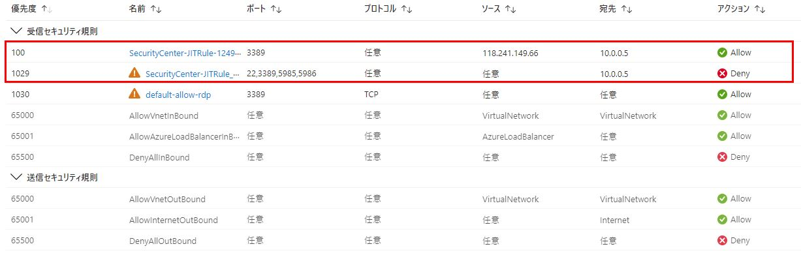

## Exercise 2: Securing the Web Application and database

Duration: 45 minutes

In this exercise, attendees will utilize Azure SQL features to data mask database data and utilize Azure Key Vault to encrypt sensitive columns for users and applications that query the database.

### Task 1: Setup the database

1. Switch to your Azure portal, select **All Services** then search for **SQL Servers**.  Select **SQL Servers**.

    

2. Select the **Azure SQL** database server you created using the Azure Manager template (Ex: AzureSecurity-INIT).

3. Select **SQL databases** under the Settings section, then select the **SampleDB** database.

    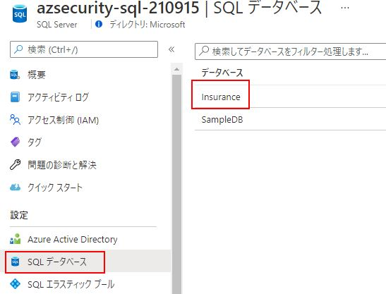

4. In the summary section, select the **Show database connection strings**.

    

5. Take note of the connection string for later in this lab, specifically the **Server** parameter:

    

6. In the Lab VM, open **SQL Server Management Studio**.

7. Enter the database server name from above.

8. Enter the username and password used from the Azure Template deployment (**wsadmin** - **p\@ssword1rocks**).

    > **Note**: If you changed the username and password in the ARM template deployment, use those values instead.

    

9. Depending on how you connected to the Azure SQL environment (inside or outside your VNet), you may be prompted to add a firewall rule. If this occurs, perform the following actions:

    - Select **Connect**, in the **New Firewall Rule** dialog, select **Sign In**.

    - Sign in with your resource group owner credentials.

    - In the dialog, select **OK**, notice how your incoming public IP address will be added for connection.

    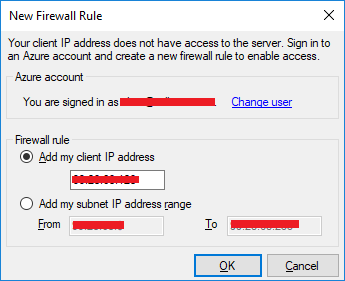
    


10. Right-click **Databases**, and select **Import Data-tier Application**.

    

11. In the Introduction dialog, select **Next**.

    

12. Select **Browse**, navigate to the extracted **/Hands-on- lab/Database** directory, and select the **Insurance.bacpac** file.

    

13. Select **Open**.

14. On the **Import Settings** dialog, select **Next**.

15. On the **Database Settings** dialog, select **Next**.

    > **Note**: If you get an error, close and re-open SQL Management Studio try the import again. If that does not work, you may need to download the latest SQL Management Studio from [here](https://docs.microsoft.com/en-us/sql/ssms/download-sql-server-management-studio-ssms?view=sql-server-2017). In some instances, the latest version may not work, version 17.3 is known to deploy the package properly.  You should also be aware that bacpac files exported from some SQL Server instances cannot be deployed to Azure SQL Servers.  We have also included a .bak file of the Insurance database that you can use to restore from.

16. Select **Finish** and the database will deploy to Azure. It may take a few minutes.

17. Once completed, select **Close**.

    

18. In **SQL Management Studio**, select **File-\>Open-\>File**.

    

19. Browse to the extracted GitHub folder, select the **\\Hands-on lab\\Database\\00\_CreateLogin.sql** file.

20. Ensure that the **master** database is selected.

21. Run the script to create a login called **agent**.

22. Browse to the extracted folder, select the **\\Hands-on lab\\Database\\01\_CreateUser.sql** file.

23. Ensure that the **Insurance** database is selected.

24. Run the script to create a non-admin user called **agent**.

### Task 2: Test the web application solution

1. In the extracted directory, double-click the **\\Hands-on lab\\WebApp\\InsuranceAPI\\InsuranceAPI.sln** solution file, and Visual Studio will open.

    > **Note**: If prompted, login using your Azure / MSDN account.

2. In the **Solution Explorer**, navigate to and double-click the **Web.config** file to open it.

    

3. Update the web.config (line 77) to point to the **Insurance** database created in Task 2. You should only need to update the server name to point to your Azure SQL Server.

    

4. Press **F5** to run the **InsuranceAPI** solution.

    > **Note**: If you get an CSC error, right-click the project, select **Clean**.  Next, right-click the project and select **Rebuild**.

5. Test the API for a response by browsing to `http://localhost:24448/api/Users`. Your port number may be different from _24448_. You should see several records returned to the browser. Copy a `UserId` value for the next instruction.

    

6. In the browser window that opens, browse to `http://localhost:24448/api/Users/e91019da-26c8-b201-1385-0011f6c365e9` you should see a json response that shows an unmasked SSN column.

    > **Note**: Depending on your browser, you may need to download to view the json response.

   

### Task 3: Utilize data masking

1. Switch to the Azure Portal.

2. Select **SQL databases**.

3. Select the **Insurance** database.

4. Under **Security**, select **Dynamic Data Masking**, then select **+Add Mask**.

    

5. Select the **User** table.

6. Select the **SSN** column.

7. Select **Add**.

    

8. Select **Save**, then select **OK**.

9. Switch back to your InsuranceAPI solution, press **F5** to refresh the page. You should see the SSN column is now masked with **xxxx**.

    

10. Close **Visual Studio**.

### Task 4: Utilize column encryption with Azure Key Vault

1. Switch to **SQL Management Studio**.

2. Select **File->Open->File**, then open the **02\_PermissionSetup.sql** file.

3. Switch to the **Insurance** database, and execute the SQL statement.

4. In the **Object Explorer**, expand the **Insurance** node.

5. Expand the **Tables** node.

6. Expand the **User** table node.

7. Expand the **Columns** node.

8. Right-click the **SSN** column, and select **Encrypt Column**.

    

    Notice that the State of the column is such that you cannot add encryption (data masking):

    

9. Select **Cancel**.

10. Switch back to the Azure Portal, and select the User_SSN data masking.

11. Select **Delete**.

    

12. Select **Save**.

13. Switch back to **SQL Management Studio**.

14. Right-click the **SSN** column, and select **Encrypt Column**.

15. Check the checkbox next to the **SSN** column.

16. For the **Encryption Type**, and select **Deterministic**.

    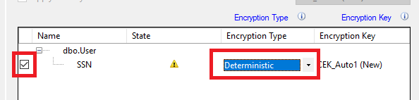

    > **Deterministic** encryption always generates the same encrypted value for any given plain text value. Using deterministic encryption allows point lookups, equality joins, grouping and indexing on encrypted columns. However, it may also allow unauthorized users to guess information about encrypted values by examining patterns in the encrypted column, especially if there's a small set of possible encrypted values, such as True/False, or North/South/East/West region. Deterministic encryption must use a column collation with a binary2 sort order for character columns.

    > **Randomized** encryption uses a method that encrypts data in a less predictable manner. Randomized encryption is more secure, but prevents searching, grouping, indexing, and joining on encrypted columns.

17. Select **Next**.

18. For the encryption select **Azure Key Vault** in the dialog.

    

19. Select **Sign In**.

20. Sign in with your Azure Portal credentials.

21. Select your Azure Key Vault.

22. Select **Next**.

23. On the **Run Settings**, select **Next**.

24. Select **Finish**, and the configured will start.

    > **Note**: You may receive a "Wrap Key" error. If so, ensure that your account has been assigned the **wrapKey** permission in the Azure Key Vault.

    

    - Select **Key vault**.

    - Select your key vault.

    - Select **Access policies**.

    - Select **Add New**.

    - For the principal, select your account.

    - Select **Key permissions**, and choose **Select all**.

        

    - Select **Secret permissions**, and choose **Select all**.

    - Select **Certificate permissions**, and choose **Select all**.

    - Select **OK**.

    - Select **Save**.

    - Retry the operation.

    > **Note**: If you are still getting errors (such as Access Denied), ensure that you have selected the correct subscription and Key Vault.

    

25. Select **Close**.

26. Right-click the **User** table, and choose **Select top 1000 rows**.

    

    You will notice the SSN column is encrypted based on the new Azure Key Vault key.

    

27. Switch to the Azure Portal.

28. Select **Key Vaults**.

29. Select your Azure Key Vault, and then select **Keys**. You should see the key created from the SQL Management Studio displayed:

    

## Exercise 3: Migrating to Azure Key Vault

Duration: 30 minutes

In this exercise, attendees will learn how to migrate web application to utilize Azure Key Vault rather than storing valuable credentials (such as connection strings) in application configuration files.

### Task 1: Create an Azure Key Vault secret

1. Switch to your Azure Portal.

2. Select **Key Vaults**, then select your Azure Key Vault.

    
    

3. Select **Secrets**, then select **+Generate/Import**.

    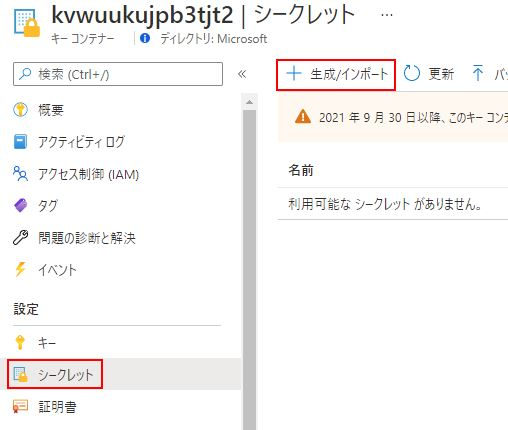

4. For the **アップロードオプション**, select **手動**.

5. For the **名前**, enter **InsuranceAPI**.

6. For the **Value,** copy the connection string information from the **InsuranceAPI** solution Web.config file in Exercise 2.

7. Select **Create**.

8. Select **Secrets**.

9. Select **InsuranceAPI**.

10. Select the 現在のバージョン.

    

11. Copy and record the secret identifier URL for later use:

    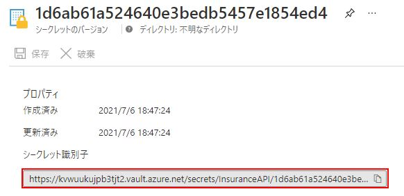

### Task 2: Create an Azure Active Directory application

1. In the Azure Portal, select **Azure Active Directory**, then select **App registrations**.

    
    

2. Select **+ 新規登録**.

3. For the user-facing display name, type **AzureKeyVaultTest**.

4. For the supported accounts, select **Accounts in this organization directory only...**

5. For the Redirect URL, type <http://localhost:12345>.

    

6. Select **登録**.

7. Copy and record the **Application ID** for later use.

    

8. In the left menu pane, under the **管理** heading, select **証明書とシークレット** link.

9. Under **クライアントシークレット**, select **新しいクライアントシークレット**.

    

10. For the 説明, enter **InsuranceAPI**.

11. For the Expires, select **12 か月**.

12. Select **追加**.

13. Copy and record the key value for later use.

### Task 3: Assign Azure Active Directory application permissions

1. Switch back to Azure Portal and select your Azure Key Vault.

2. Under the **設定** heading, select **アクセス ポリシー**.

3. Select **+ アクセス ポリシーの追加**.

    

4. Choose **Select principal** field value. In the right-hand pane, type **AzureKeyVaultTest**. Select the item.

5. Choose the **Select** button at the bottom.

6. Select the **シークレットのアクセス許可** drop-down, check the **取得** and **一覧** permissions.

    
 "Secret Permission Options")

    Your selection summary should look like this.

    

7. Select **追加** button.

8. Select **保存** button at the top.

### Task 4: Install or verify NuGet Package

1. Close the previous Visual Studio solution, then from the extracted GitHub directory, open the **\\Hands-on lab\\WebApp\\InsuranceAPI\_KeyVault\\InsuranceAPI.sln** solution.

    >**Note**:  Be sure you re-open the correct solution.

    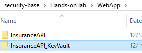

2. Switch to **Visual Studio**.

3. In the menu, select **表示-\>その他のウインドウ-\>パッケージ マネージャー コンソール**.

4. In the new window that opens, run the following commands:

    ```PowerShell
    Install-Package Microsoft.CodeDom.Providers.DotNetCompilerPlatform
    ```

    ```PowerShell
    Install-Package Microsoft.IdentityModel.Clients.ActiveDirectory -Version 2.16.204221202
    ```

    ```PowerShell
    Install-Package Microsoft.Azure.KeyVault
    ```

    > **Note**: These already exist in the project but are provided as a reference. If you receive a codedom version error when you debug, run this command.

    ```PowerShell
    Update-Package Microsoft.CodeDom.Providers.DotNetCompilerPlatform -r
    ```

5. From **Solution Explorer**, double-click the **Web.config** file to open it.

    Notice the **appSettings** section has some token values:

    

6. Replace the **ApplicationId** (**ClientId**) and **ClientSecret** with the values from Task 2.

    

7. Replace the **SecretUri** with the Azure Key Vault secret key Uri from Task 1.

8. Save the Web.config file in Visual Studio.

    > **Note**:  You can take this lab a step further and publish the Web App to an Azure App Service  and enable [System-assigned Managed Identities](https://docs.microsoft.com/en-us/azure/app-service/overview-managed-identity?tabs=dotnet).  This will allow you to completely remove any authentication from your configurations and utilize [Key Vault references](https://docs.microsoft.com/en-us/azure/app-service/app-service-key-vault-references).

### Task 5: Test the solution

1. Open the **Web.config**, and comment out or delete the **connectionString** from the file at line 78.

2. Open the **Global.asax.cs** file, and place a break point at line 28.

    > **Note**: This code makes a call to get an accessToken as the application you set up above, then make a call to the Azure Key Vault using that accessToken.

3. Press **F5** to run the solution.

    You should see that you execute a call to Azure Key Vault and get back the secret (which in this case is the connection string to the Azure Database).

    

4. Press **F5** to continue the program.

5. Navigate to [http://localhost:portno/api/Users](http://localhost:portno/api/Users), you should get an error. Because you encrypted the column in the previous exercise, EntityFramework is not able to retrieve the value(s) using default settings. In order to do seamless decryption, you would need to:

    - Run the **\\Hands-on lab\\Database\\02\_PermissionSetup.sql** script if you have not already done so.

    - Add the [AzureKeyVaultProvider for Entity Framework](https://blogs.msdn.microsoft.com/sqlsecurity/2015/11/10/using-the-azure-key-vault-key-store-provider-for-always-encrypted/) reference to the project.

    - Register the provider code in order for .NET to handle the encrypted column.
  
    - Add an access policy to the Azure Key Vault that gives key permissions (`decrypt`, `sign`, `get`, `unwrapkey`, `verify`) to the Azure AD application.

    - Add the `Column Encryption Setting=Enabled` to the connection string.

    - Detailed steps can be found in this [blog post](https://docs.microsoft.com/en-us/archive/blogs/sqlsecurity/using-the-azure-key-vault-key-store-provider-for-always-encrypted)

    - A third solution (**\\Hands-on lab\\WebApp\\InsuranceAPI\_KeyVault\_Encrypted\\InsuranceAPI.sln**) was added to the GitHub repo that has the necessary references and code added.  
  
      - Simply update the web.config file with your client id and secret after adding the required Key Vault permissions above.
  
      - Update the Key Vault connection string to have the `Column Encryption Setting=Enabled`.

      - Review the code added to the global.asax.cs file.

      - Run the project and navigate to the above page.

## Exercise 4: Securing the network

Duration: 45 minutes

In this exercise, attendees will utilize Network Security Groups to ensure that virtual machines are segregated from other Azure hosted services and then explore the usage of the Network Packet Capture feature of Azure to actively monitor traffic between networks.

### Task 1: Test network security group rules \#1

1. In the Azure Portal, select **Virtual Machines**.

2. Select **paw-1**, then select **Connect**.  

3. In the dialog, select **Download RDP file Anyway**.  Open the downloaded RDP file and connect to the Virtual Machine.

    > **Note**: Default username is **wsadmin** with **p\@ssword1rocks** as password and you may need to request JIT Access if you have taken a break between exercises.

4. In the **paw-1** virtual machine, open **Windows PowerShell ISE** as **administrator**.

    - Select the **Windows** icon.

    - Right-click **Windows PowerShell ISE**, choose **More**, then select **Run as Administrator**.

5. Copy and run the following command:

    ```PowerShell
    Set-ExecutionPolicy -ExecutionPolicy Unrestricted
    ```

    

6. In the dialog, select **Yes**.

7. Select **File-\>Open**, browse to the extracted GitHub directory and open the **\\Hands-on lab\\Scripts\\PortScanner.ps1**.

    > **Note**: You would have downloaded the [GitHub repo](https://github.com/Microsoft/MCW-Azure-Security-Privacy-and-Compliance) and extracted this in the setup steps.  If you did not perform those steps, perform them now. You can also choose to copy the file from your desktop to the VM.

8. Review the script. Notice that it does the following for various exercises:

   - Installs Putty

   - Installs NotePad++

   - Adds hosts entries for DNS

   > **Note**: When using multiple virtual networks, you must setup a DNS server in the Azure tenant.

   - Executes port scans

   - Executes brute force SSH attack

9. Press **F5** to run the script for exercise 4. You should see the following:

    > **Note**:  The ARM template deploys a Deny All rule.  If you were to simply create a Network Security Group from the UI, you would not experience this behavior.

    - Port scan for port 3389 (RDP) to **db-1** and **web-1** is unsuccessful from the **paw-1** machine.

    - The information above for port 3389 (RDP) is visible after running the script and pressing **F5**.

    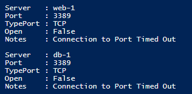

    - Port scan for port 1433 (SQL) to **db-1** and **web-1** is unsuccessful from the **paw-1** machine. **db-1** is running SQL Server but traffic is blocked at NSG and via the Windows Firewall by default, however a script ran in the ARM template to open port 1433 on the db-1 server.

    

    - Port scan for port 80 (HTTP) to **db-1** and **web-1** is unsuccessful from the **paw-1** machine, if traffic was allowed, it would always fail to **db-1** because it is not running IIS or any other web server.

    

### Task 2: Configure network security groups

1. Switch to the [Azure Portal](https://portal.azure.com).

2. Configure the database server to only allow SQL Connections from the web server:

   - Select **ネットワーク セキュリティ グループ**.

   - Select **DbTrafficOnly**.

   - Select **受信セキュリティ規則**.

   - Select **+ 追加**.

   - For the **ソース**, select **IP Addresses**.

   - For the **ソース IP アドレス**, enter **10.2.0.4**.
  
   - For the **宛先**, keep **Any**.

   - For the **宛先ポート範囲**, enter **1433**.

   - For the **優先度**, enter **100**.

   - For the **名前**, enter **Port_1433**.

   - Select **追加**.

   - Select **+ 追加**.

   - For the **ソース**, select **IP Addresses**.

   - For the **ソース IP アドレス**, enter **10.0.0.5**.
  
   - For the **宛先**, keep **Any**.

   - For the **宛先ポート範囲**, enter **1433**.

   - For the **優先度**, enter **102**.

   - For the **名前**, enter **Port_1433_Paw**.

   - Select **追加**.

3. Configure the web server to allow all HTTP and HTTPS connections:

   - Select **ネットワーク セキュリティ グループ**.

   - Select **WebTrafficOnly**.

   - Select **受信セキュリティ規則**.

   - Select **+ 追加**.

   - For the **ソース**, keep **Any**.

   - For the **宛先**, keep **Any**.

   - For the **宛先ポート範囲**, enter **80,443**.

   - For the **優先度**, enter **100**.

   - Change the **名前** to **Port\_80\_443**.

   - Select **追加**.

   > **Note**: In some rare cases it may take up to 15 minutes for your Network Security Group to change its status from **Updating**.  You won't be able to add any other rules until it completes.

4. Configure both the database and web server to only allow RDP connections from the PAW machine:

    - Select **ネットワーク セキュリティ グループ**. For both the **DbTrafficOnly** and **WebTrafficOnly**, do the following:

       - Select **受信セキュリティ規則**.

       - Select **+ 追加**.

       - For the **ソース**, select **IP Addresses**.

       - For the **ソース IP アドレス**, enter **10.0.0.5**.

       - For the **宛先ポート範囲**, enter **3389**.

       - For the **優先度**, enter **101**.

       - For the **名前**, enter **Port_3389**.

       - Select **追加**.

5. Configure all Network Security Groups to have Diagnostic logs enabled.

    - Select **ネットワーク セキュリティ グループ**. For each NSG (DBTrafficOnly and WebTrafficOnly), do the following:

       - In the content menu, select **診断設定**, and then select **+ 診断設定を追加する**.

        

      - For the name, enter the NSG name and then add **Logging** to the end.

      - Check the **Log Analytics ワークスペースへの送信** checkbox, in the **Log Analytics** box, select **Configure**.

      - Select the **azseclog...** workspace.

      - Select both LOG checkboxes.

      - Select **保存**.

       

### Task 3: Test network security group rules \#2

1. Switch back to the **paw-1** virtual machine.

2. Press **F5** to run the **PortScan** script. You should see the following:

    - Port scan for port 3389 (RDP) to **db-1** and **web-1** is successful from the **paw-1** machine.

    

    - Port scan for port 1433 (SQL) to **db-1** is successful, and **web-1** is unsuccessful from the **paw-1** machine.

    > **Note**: If the ARM script failed, you may need to disable the windows firewall on the db-1 server to achieve this result.

    

    - **Note**: The ARM Template installed IIS on web-1, the port scan for port 80 (HTTP) to **web-1** is successful from the **paw-1** machine, however to **db-1** is unsuccessful as it is not running IIS.

    

### Task 4: Install network watcher VM extension

1. Switch to the Azure Portal.

2. Select **Virtual Machines**.

3. Select **db-1**.

4. In the blade menu, select **拡張機能**, then select **+ 追加**.

    

5. Browse to the **Network Watcher Agent for Windows**, and select it.

6. Select **次へ**. **確認と作成**. **作成**.

    

7. In the next **Install extension** dialog window (note that it could be blank) select **OK.** You should see a dialog toast notification about the script extension being installed into the Virtual Machine.

    

### Task 5: Setup network packet capture

1. In the main Azure Portal menu, search **All services** for **Network Watcher**.

2. In the context menu, select **Network Watcher**.

    

3. **+ 追加**ボタン。 Expand the subscription regions item you are running your labs in.

4. For the **East US** region (or whatever region you deployed your VMs too), select the ellipsis, then select **Enable network watcher**.

    

5. In the new context menu, select **Packet capture**.

6. Select **+Add**.

    

7. Select your subscription.

8. Select your resource group.

9.  For the target virtual machine, ensure that **db-1** is selected.

10. For the capture name, enter **databasetraffic**.

11. Notice the ability to save the capture file to the local machine or an Azure storage account. Ensure that the resource group storage account is selected.  If you check your resource group, the storage account is prefixed with **"diagstor"**.

12. For the values, enter the following:

    - Maximum bytes per packet: 0.
    - Maximum bytes per session: 1073741824.
    - Time limit: 600.

    

13. Select **保存**.

### Task 6: Execute a port scan

1. Switch your Remote Desktop connection to the **paw-1** virtual machine.

2. Uncomment the following line of the script, and press **F5**.

    ```PowerShell
    #TestPortRange $computers 80 443;
    ```

   

    > **Note**: You should see the basic ports scanned, and then a port scan from 80 to 443. This will generate many security center logs for the Network Security Groups which will be used in the Custom Alert in the next set of exercises. Continue to the next exercise while the script executes.

## Exercise 5: Azure Security Center

Duration: 45 minutes

Azure Security Center provides several advanced security and threat detection abilities that are not enabled by default. In this exercise we will explore and enable several of them.

### Task 1: Linux VM and Microsoft Monitoring Agent (MMA) install

1. In the Azure Portal, browse to your **azsecurity-INIT** resource group, then select the *azseclog...* **Log Analytics Workspace**.

    

2. In the blade, select **Agents management**.

3. Record the `Workspace ID` and the `Primary key` values.

   

4. Switch to the Remote Desktop Connection to the **paw-1**.

5. Open the **Putty** tool, login to the **linux-1** machine using the username and password.
(###名前解決できているか確認)

   

6. Run the following commands, be sure to replace the workspace tokens with the values you records above:

    ```bash
    wget https://raw.githubusercontent.com/Microsoft/OMS-Agent-for-Linux/master/installer/scripts/onboard_agent.sh && sh onboard_agent.sh -w <YOUR_WORKSPACE_ID> -s <YOUR_WORKSPACE_KEY>

    sudo /opt/microsoft/omsagent/bin/service_control restart <YOUR_WORKSPACE_ID>

    ```

7. Switch back to the Azure Portal.

8. In the blade menu, select **エージェント管理** and then select **Linux  サーバー** タブ, you should see **1 台の Linux コンピューターが接続されています**.

   

   > **Note**: In most cases, Azure will assign resources automatically to the log analytics workspace in your resource group.

### Task 2: Execute brute force attack

1. Switch to the Remote Desktop Connection to the **paw-1**.

2. In the PowerShell ISE, comment the lines for Exercise 4, then uncomment the lines for Exercise 5.

3. Run the script, notice how it will execute several attempts to login via SSH to the **linux-1** machine using the plink tool from putty.

4. After a few moments (up to 30 mins), you will see an alert from Security Center about a successful brute force attack.

    


### Task 3: Enable change tracking and update management

1. Switch back to the Azure Portal.

2. In the search menu, type **Virtual Machine**, then select it.

3. Highlight the **paw-1**, **web-1**, **db-1** and **linux-1** virtual machines that were deployed.

4. In the top menu, select **Services**, then select **Change Tracking**.

   

5. Select the **カスタム** radio button.

6. Select **change**, select the **Log Analytics Workspace** that was deployed with the lab ARM template.

    

7. Select the log analytics workspace for your resource group and then select the matching automation account, then select **OK**.

    

8. Select all the virtual machines, then select **Enable**.

    ※サブスクリプションが出てこない場合、各仮想マシンで変更履歴を有効化する。
    


9. Navigate back to the **Virtual Machines** blade, again highlight the **paw-1**, **web-1**, **db-1** and **linux-1** virtual machines that were deployed.

10. In the top menu, select **Services**, then select **Inventory**.

11. Select the **CUSTOM** radio button.

12. Select **change**, select the **Log Analytics Workspace** that was deployed with the lab ARM template.

13. Notice that all the VMs are already enabled for the workspace based on the last task.

14. Navigate back to the **Virtual Machines** blade, again, highlight the **paw-1**, **web-1**, **db-1** and **linux-1** virtual machines that were deployed.

15. In the top menu, select **Services**, then select **Update Management**.

16. Select the **CUSTOM** radio button.

17. Select **change**, select the **Log Analytics Workspace** that was deployed with the lab ARM template.

18. Select all the virtual machines, then select **Enable**.

19. Browse to your resource group, then select your Log Analytics workspace.

20. Under the **General** section, select the **Solutions** blade, you should see the **ChangeTracking** and **Updates** solutions were added to your workspace. Select the **ChangeTracking** solution.

    

21. Under **Workspace Data Sources** section, select **ソリューションのターゲット設定(プレビュー)**.

22. Remove any scopes that are displayed via the ellipses to the right of the items.

    

23. Repeat the steps to remove the solution targeting for the **Updates** solution.

### Task 4: Review MMA configuration

1. Switch to the Remote Desktop Connection to the **paw-1**.

2. Open **Event Viewer**.

3. Expand the **Applications and Services Logs**, then select **Operations Manager**.

4. Right-click **Operations Manager**, select **Filter Current Logs**.

    

5. For the event id, type **5001**, select the latest entry, you should see similar names to all the solutions that are deployed in your Log Analytics workspace including the ones you just added:

    

6. Open **Windows Explorer**, browse to **C:\Program Files\Microsoft Monitoring Agent\Agent\Health Service State\Management Packs** folder.

7. Notice the management packs that have been downloaded that correspond to the features you deployed from Azure Portal.

    

### Task 5: Adaptive Application Controls

1. Switch to the Azure Portal.

2. Select **Azure Security Center**.

3. In the blade menu, scroll to the **クラウド セキュリティ** section and select **適応型アプリケーション制御**.

4. You will likely have several groups displayed, find the one that has your newly created lab VMs.

   

5. Expand the **Publisher whitelisting rules** section, you should see that Google Chrome and Notepad++ were picked up and have Microsoft Certificated tied to them.

   

6. In the top menu, select **Group settings**.

7. Review the available settings.

> **Note**: As of June 2020, the **Enforce** option is temporarily disabled.

### Task 6: File Integrity Monitoring

1. Switch to the Azure Portal.

2. Select Azure Security Center.

3. In the blade menu, scroll to the **クラウド セキュリティ** section and select **ファイルの整合性の監視**.

4. For the log workspace tied to your lab environment virtual machines, if displayed, select **Upgrade Plan**, then select **ファイルの整合性の監視を試す**.

5. Select the workspace only, then select **アップグレード**.

6. Select the **エージェントをインストールせずに続行します** link.

   

7. If displayed, select **有効化**, otherwise simply select the workspace.

8. In the menu, select **設定**.

    

9. Select the **Windows Files** tab.

10. Select **+Add**.

11. For the item name, type **HOSTS**.

12. For the path, type **c:\windows\system32\drivers\etc\\\***.
    パスの種類を**フォルダー**。
    再帰を**オン**。


13. Select **保存**.

    

14. Select the **ファイルコンテンツ** タブ.

15. Select **リンク **, then select the storage account tied to your lab.

    > **Note**: It will take 30-60 minutes for Log Analytics and its management packs to execute on all your VMs. As you may not have that much time with this lab, screen shots are provided as to what results you will eventually get.

    

16. Switch to the Remote Desktop Connection to the **paw-1**.

17. Open the **c:\windows\system32\drivers\etc\hosts** file.

18. Add the following entry:

    ```cmd
    10.0.0.6    linux-1
    ```

19. Save the file.

20. After about 30-60 minutes, the Log Analytics workspace will start to pick up changes to your files, registry settings and windows services:

    

21. You will also start to see the file snapshots show up in the storage account:

    

### Task 7: Disk encryption

1. Switch to the Azure Portal.

2. Browse to your resource group.

3. Browse to your key vault.

4. In the blade menu under **Settings**, select **Access Policies**.

5. Select the **Azure Disk Encryption for volume encryption** checkbox.

   

6. Select **Save**.

7. Browse to your resource group.

8. Select the **linux-1** virtual machine.

9. In the blade menu, select **Disks**.

10. In the top menu, select **Encryption**.

    

11. For **Disks to encrypt**, select **OS Disk**.

12. Select the **Select a key vault and key for encryption** link.

13. Select the lab key vault.

14. For the key, select **Create new**.

15. For the name, type **vm-disk-key**.

16. Select **Create**.

    

17. For the **Version**, select the new version.

18. Select **Select**.

19. Select **Save**, then select **Yes** when prompted.

> **Note**: Disk encryption can take some time, move on to the next exercises.

## Exercise 6: Azure Sentinel logging and reporting

Duration: 20 minutes

In this exercise, you will setup Azure Sentinel to point to a logging workspace and then create custom alerts that execute Azure Runbooks.

### Task 1: Create a dashboard

1. Open the Azure Portal.

2. Select **All services**, then type **Sentinel**, select **Azure Sentinel**.

    

3. In the blade, select **+Add**, select the **Log Analytics** resource for your resource group, then choose **Add Azure Sentinel**.

   

4. In the blade, under **驚異管理**, select **ブック**.

5. In the list of workbooks, select **Azure AD 監査ログ**, select **保存**.

6. Select the region and select **OK**.

    

7. In the list of workbooks, select **Azure Network Watcher**, choose **保存**.

8. Select the リージョン and choose **OK**.

9. Select **View saved workbook**, take a moment to review your new workbook.

    > **Note**: You may not have data in the log analytics workspace for the targeted workbook queries.

### Task 2: Create an Analytics alert

1. Navigate back to the **Azure Sentinel** workspace, in the **構成** blade section, select **分析** then select **+ 作成** then **Scheduled query rule**.

    

2. On the **全般** tab, enter **PortScans** for the 名前.

3. For the 説明, enter **A custom rule to detect port scans**, select **次: ルールのロジックを設定**.

4. In the **ルールのクエリ** text box, type:

    ```PowerShell
    AzureDiagnostics
    | where ruleName_s == 'UserRule_DenyAll' and Type != 'AzureMetric' and type_s == 'block' and direction_s == 'In' and OperationName == 'NetworkSecurityGroupCounters'
    | summarize AggregatedValue = sum(matchedConnections_d) by ruleName_s, primaryIPv4Address_s
    | where AggregatedValue > 0
    ```

    > **Note**: If you wanted to target a specific NSG, you can add `and Resource == 'WEBTRAFFICONLY'` to the query.

    

    > **Note**: If you were quick going through the labs, then you may not have log data in the Log Analytics workspace just yet that corresponds to "AzureMetric". You may need to wait 15-30 minutes before a query will execute.

    > **Note**: Since the introduction of Azure Security Center and Sentinel, the backend logging has changed a few times as well as the way the calculations are done in the rule query (timespan in query vs outside query, etc.). The ultimate goal of this query is to find when a series of failed connection attempts have been made against a network security group and a specific deny rule. If for some reason the UI/backend has been modified since the last published lab, modify the query to accomplish this goal.

5. Under **エンティティ マッピング**, for the **IP**, select the **primaryIPv4Address_s** column, then select **Add**.

6. Under **クエリのスケジュール設定**, for the **クエリの実行間隔** setting, type **5** 分.

    >**Note**:  This is a lab and you want to see the results as quickly as possible. In a production environment, you may want to choose a different time threshold.

7. For the **次の時間分の過去のデータを参照します**, type **2** 時間.

8. Under **アラートのしきい値**, for the **クエリ結果件数でアラートを生成する**, enter **0**.

    > **Note:** We want to hit the threshold quickly for lab purposes. This query and value may not be appropriate for production and is only for learning purposes.

    Review the current data to determine what would trigger the alert.  Notice the red threshold line intersects the blue event data line.

    

9. Select **次: インシデントの設定 (プレビュー)**, review the potential incident settings.

10. Select **次: 自動応答**, notice you have no playbooks to select yet.

11. Select **次: レビュー**.

12. Select **作成**.

    > **Note**:  It may take a few minutes for the alert to fire.  You may need to run the PortScan script a few times from **paw-1**

    

### Task 3: Investigate a custom alert incident

1. In the main menu, select **Azure Sentinel**.

2. Select **Incidents**.

3. Select the new **PortScans** incident.

    

    > **Note**: It may take 15-20 minutes for the alert to fire. You can continue to execute the port scan script to cause log events or you can lower the threshold for the custom alert.

4. In the dialog, choose **Investigate**. Note that it may take a few minutes for the button to be available.

    
    

5. In future versions, you will get to see insights about the alerts and the resources related to what caused it to fire:

    

### Task 4: Create and run a playbook

1. In the **Azure Sentinel** blade, select **オートメーション**.

2. In the new window, select **+ Add Playbook**.

    

3. The **Create logic app** blade will display:

    - For the name, enter **Email**.

    - Select your existing resource group.

    - Toggle the **Log Analytics** to **On** and then select your **azuresecurity** Log Analytics workspace.

   

4. Select **確認および作成** then select **作成**.  After **リソースに移動**, the **Logic Apps Designer** will load. If the designer does not load, wait a few minutes and refresh the Playbook list. Select the **Email** playbook.

    

5. Select the **Get a notification email when Security Center detects a threat** template.

    

6. Select **このテンプレートを使用する**.

    

7. For the **Office 365 Outlook** connection, select the **+** link, enter your Azure/O365 credentials.

    

    > **Note**: This would need to be a valid Office 365 account, if you do not have a valid Office 365 account, then utilize a basic email template for Outlook.com.

8. For the **Security Center Alert** connection, select the **+** link.

9. Select **続行**.

    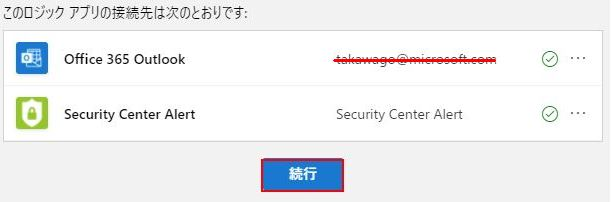

10. For the email address, enter your email.

11. Select **Save**. You now have an email alert action based on LogicApps for your custom security alert to use.

    

12. Lastly, after you have created the new Playbook, ensure that the status is **有効**.  If not, then select **有効** in the menu.

### Task 5: Execute Jupyter Notebooks

1. In the **Azure Sentinel** blade, select **ノートブック**.

2. Search for the **Azure Sentinel ML ノートブックのファースト ステップ ガイド** item.

    

3. In the right dialog, select **ノートブックの保存**.

4. If not already logged in, select your Azure credentials, the GitHub repo will start to clone into your workspace. You will see the GitHub progress meter.

    

5. The notebook should open in the Jupyter notebooks application. It will also start a container kernel for executing the notebook cells.

6. Follow the directions of the notebook while executing each cell. The notebook will required you to setup some supported API accounts to merge external security data such as known bad actors and other geographical information.

    

### Task 6: Creating reports with Power BI

1. Navigate back to your **Azure Sentinel** browser window.  Select **ログ**.

    >**Note**: You may see a **Welcome to Log Analytics** splash page in the blade.  Select **Get Started**.

    

2. In the **Schema** tab under **Active**, expand the **LogManagement** node, notice the various options available.

3. In the schema window, ダブルクリック **AzureDiagnostics**, then 
**実行**.

4. In the top right, select **Export**, then select the **Export to Power BI (M Query)** link.

    

    

5. Select **Open**, a text document with the Power Query M Language will be displayed.

6. Follow the instructions in the document to execute the query in Power BI.

    

7. Close **Power BI**.

## Exercise 7: Using Compliance Tools (Azure Policy, Secure Score and Compliance Manager)

Duration: 15 minutes

In this exercise, attendees will learn to navigate the Azure Policy and Secure Score features of Azure.  You will also explore the Compliance Manager portal that will provide you helpful tasks that you should consider when attempting to achieve specific compliance policies.

### Task 1: Review a basic Azure Policy

1. Open the [Azure Portal](https://portal.azure.com).  Select **すべてのサービス**, then type **ポリシー**.  Select **ポリシー** in the list of items.

    

2. In the blade menu, select **コンプライアンス**, and review your **リソースの全体的なコンプライアンス**  のパーセンテージ.

    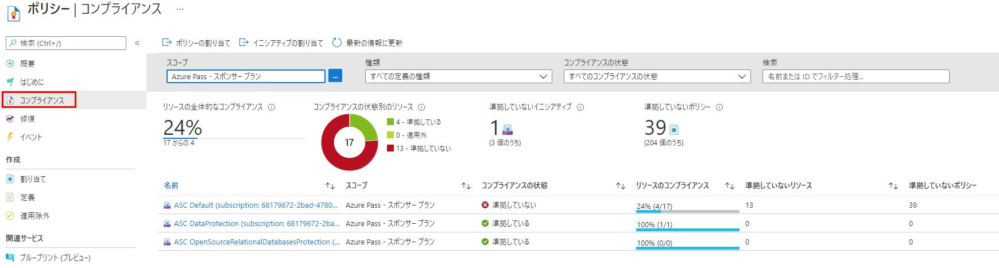

3. For the scope, ensure the proper subscription is selected, then select **ASC DataProtection (subscription:**.

4. In the **イニシアティブ コンプライアンス** blade, review your compliance metrics.

5. Scroll to the results area and select the **準拠していないリソース** tab.

    

6. In the filter search box, type **paw-1** and select it when displayed.

    > **Note**: You may not see resources display right away.  If this is the case, then scroll through some other non-compliant resources.

7. With the **Policies** tab selected, review the policies that the resource is non-complying against.

    >**Note**: New policies are being created and your number may be different from the image below.

    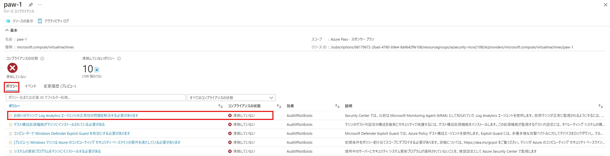

8. Choose one of the policies.  Review the Definition JSON of the policy definition **定義の表示**, notice how it is based on ARM Template format and is looking for specific properties to be set of the non-compliant resources.

    

    > **Note**: You can use these out of box templates to build your own policies and apply them as blueprints.

### Task 2: Review and create Azure Blueprints

1. In the Policy blade, under **Authoring**, select **Definitions**.  These are a list of all defined policies which can be selected for assignment to your subscription resources.

    

2. In the Policy blade, under **関連サービス**, select **ブループリント**.

3. In the Blueprints blade, select **ブループリントの定義**.

4. Select **+ ブループリントの作成**.

    

5. Review some of the sample blueprints, then select **Start with blank blueprint**.

    

6. For the name, type **GDPRBluePrint**.

7. For the location, select the ellipses, then select your subscription in the drop down.

8. Choose **選択**.

    

9. Select **次へ: 成果物**.

10. Select **+ 成果物の追加**.

11. For the Artifact Type, select **ポリシーの割り当て**, review all the policies available to you (at the time of this writing you would see 37 definitions and 311 policies).
12. In the search box, type **制限**, browse for the **ストレージ アカウントではネットワークアクセスを制限する必要があります**.

    

    > **Note**: If the above definition is not available, select one of your own choosing.

13. Select **追加**.

14. Select **下書きの保存**. It may take a few minutes.  The blade will automatically change when the save operation finishes.

15. For the new blueprint, select the ellipses, then select **ブループリントを発行する**.

    

16. For the version type **1.0.0**.

17. Select **公開**.

18. For the new blueprint, select the ellipses, then select **ブループリントの割り当て**.

    

19. Review the page, then choose **割り当て**.  This policy will now be audited across all your storage accounts in the specific subscription.

### Task 3: Secure Score

1. In the Azure Portal, select **すべてのサービス**, then type **セキュリティ**, select **セキュリティセンター**.

2. In the Security Center blade, under **クラウド セキュリティ**, select **セキュア スコア**.

3. Review your overall secure score values and then notice the category values.

    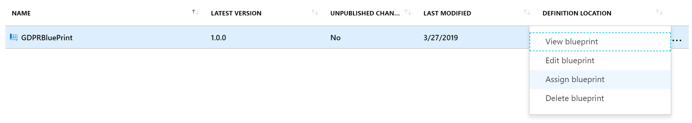

4. On the bottom half of the window, select your subscription, you will be presented with the items that have failed resource validation sorted by the score value that is assigned to that particular recommendation item.

5. Select the **An Azure Active Directory administrator should be provisioned for SQL Servers**, on the recommendation blade, you will be presented with information about how to remediate the recommendation to gain the impact value to your score.

    

### Task 4: Use Compliance Manager for Azure

>**Note**: You may need additional permissions to run this portion of the lab. Contact your Global Administrator.

1. In a browser, go to the Service Trust/Compliance Manager portal (<https://servicetrust.microsoft.com>).

2. In the top corner, select **Sign in**, you will be redirected to the Azure AD login page.

    

3. If prompted, select or sign in with your Azure AD\\Office 365 credentials.

4. In the menu, select **Compliance Manager->Compliance Manager Classic**.

    

5. Select on the **+ 評価の追加** link.

6. Select **新しいグループを作成する**, for the name type **AzureSecurity**, select **次へ**, set the **既存のグループからデータをコピーしますか？** toggle to **いいえ**, select **次へ**.

    

7. For the product dropdown, select **Azure**.

    
8. For the certification dropdown, select **GDPR**.

    

9. Select **ダッシュボードに追加.** You will now see a new assessment for Azure and GDPR in progress:

    

10. Select **Azure GDPR**.

11. Review the various controls that you can implement:

    

12. On the top menu, choose **トラスト ドキュメント**, then select **監査レポート**.

    

13. Notice the various tabs that you can select from, select **FedRAMP Reports**.

14. These are all the FedRAMP reports sorted by date that have been performed and publicly posted for Azure customer review. Select the item displayed and briefly review the document.

    

## After the hands-on lab

Duration: 10 minutes

In this exercise, attendees will un-provision any Azure resources that were created in support of the lab.

### Task 1: Delete resource group

1. Using the Azure portal, navigate to the Resource group you used throughout this hands-on lab by selecting **Resource groups** in the menu.

2. Search for the name of your research group, and select it from the list.

3. Select **Delete** in the command bar, and confirm the deletion by re-typing the Resource group name and selecting **Delete**.

4. Don't forget to delete the Azure Key Vault application you created in Exercise 3, Task 3.

### Task 2: Remove Standard Tier Pricing

1. Be sure to set your Azure Security pricing back to **Free**.

### Task 3: Delete lab environment (optional)

1. If you are using a hosted platform, make sure you shut it down or delete it.

You should follow all steps provided *after* attending the Hands-on lab.
