<div class="MCWHeader1">
Azure セキュリティ ベースライン
</div>

<div class="MCWHeader2">
ハンズオン ラボ ステップ バイ ステップ
</div>

<div class="MCWHeader3">
July 2021
</div>

# **コンテンツ**
- [**コンテンツ**](#コンテンツ)
- [Azure セキュリティ ベースライン hands-on lab step-by-step](#azure-セキュリティ-ベースライン-hands-on-lab-step-by-step)
  - [学習目標](#学習目標)
  - [概要](#概要)
  - [ソリューション アーキテクチャー](#ソリューション-アーキテクチャー)
  - [Exercise 1: Just-in-Time（JIT）アクセスの導入](#exercise-1-just-in-timejitアクセスの導入)
    - [Task 1: JITによる仮想マシンのセットアップ](#task-1-jitによる仮想マシンのセットアップ)
    - [Task 2: JITリクエストの実行](#task-2-jitリクエストの実行)
  - [Exercise 2: Webアプリケーションとデータベースの保護](#exercise-2-webアプリケーションとデータベースの保護)
    - [Task 1: データベースの設定 (※ データベース設定済みの環境が存在する場合は Task 2 へ)](#task-1-データベースの設定--データベース設定済みの環境が存在する場合は-task-2-へ)
    - [Task 2: Webアプリケーションソリューションのテスト](#task-2-webアプリケーションソリューションのテスト)
    - [Task 3: データマスキングの活用](#task-3-データマスキングの活用)
    - [Task 4: Azure Key Vaultによるカラム暗号化の利用](#task-4-azure-key-vaultによるカラム暗号化の利用)
  - [Exercise 3: Migrating to Azure Key Vault](#exercise-3-migrating-to-azure-key-vault)
    - [Task 1: Azure Key Vaultのシークレットの作成](#task-1-azure-key-vaultのシークレットの作成)
    - [Task 2: Azure Active Directoryアプリケーションの作成](#task-2-azure-active-directoryアプリケーションの作成)
    - [Task 3: Azure Active Directoryのアプリケーション権限の割り当て](#task-3-azure-active-directoryのアプリケーション権限の割り当て)
    - [Task 4: NuGetパッケージのインストールまたは検証](#task-4-nugetパッケージのインストールまたは検証)
    - [Task 5: ソリューションのテスト](#task-5-ソリューションのテスト)
  - [Exercise 4: ネットワークの保護](#exercise-4-ネットワークの保護)
    - [Task 1: ネットワークセキュリティのグループルールのテスト \#1](#task-1-ネットワークセキュリティのグループルールのテスト-1)
    - [Task 2: ネットワークセキュリティグループの設定](#task-2-ネットワークセキュリティグループの設定)
    - [Task 3: ネットワークセキュリティのグループルールのテスト \#2](#task-3-ネットワークセキュリティのグループルールのテスト-2)
    - [Task 4: ネットワークウォッチャーVM拡張機能のインストール](#task-4-ネットワークウォッチャーvm拡張機能のインストール)
    - [Task 5: ネットワークパケットキャプチャの設定](#task-5-ネットワークパケットキャプチャの設定)
    - [Task 6: ポートスキャンの実行](#task-6-ポートスキャンの実行)
  - [Exercise 5: Azure Security Center](#exercise-5-azure-security-center)
    - [Task 1: Linux VMとMicrosoft Monitoring Agent（MMA）のインストール](#task-1-linux-vmとmicrosoft-monitoring-agentmmaのインストール)
    - [Task 2: ブルートフォースアタックの実行](#task-2-ブルートフォースアタックの実行)
    - [Task 3: 変更追跡と更新管理を有効にする](#task-3-変更追跡と更新管理を有効にする)
    - [Task 4: MMA構成の見直し](#task-4-mma構成の見直し)
  - [Exercise 6: Azure Sentinelのログとレポート](#exercise-6-azure-sentinelのログとレポート)
    - [Task 1: ダッシュボードの作成](#task-1-ダッシュボードの作成)
    - [Task 2: 分析アラートの作成](#task-2-分析アラートの作成)
    - [Task 3: カスタムアラートのインシデントを調査する](#task-3-カスタムアラートのインシデントを調査する)
    - [Task 4: Power BIでのレポート作成](#task-4-power-biでのレポート作成)
  - [Exercise 7: コンプライアンスツール（Azure Policy、Secure Score）の使用について](#exercise-7-コンプライアンスツールazure-policysecure-scoreの使用について)
    - [Task 1: Review a basic Azure Policy](#task-1-review-a-basic-azure-policy)
    - [Task 2: Azure ブループリントの確認と作成](#task-2-azure-ブループリントの確認と作成)
    - [Task 3: セキュア スコア](#task-3-セキュア-スコア)
  - [ハンズオンラボの終了後](#ハンズオンラボの終了後)
    - [Task 1: リソースグループの削除](#task-1-リソースグループの削除)
    - [Task 2: Azure Defender Pricingの削除](#task-2-azure-defender-pricingの削除)


# Azure セキュリティ ベースライン hands-on lab step-by-step

## 学習目標

この実習では、Azure Security Center の機能の多くを実装して、クラウドベースの Azure インフラストラクチャ（IaaS）とアプリケーション（PaaS）を保護します。具体的には、インターネットに公開されているリソースが適切に保護されていること、必要のないインターネットアクセスが無効になっていることを確認します。さらに、アプリケーション・セキュリティを有効にしている管理者のために「ジャンプ・マシン」を導入し、クラウド・リソースを外部に公開することを防ぎます。さらに、カスタムアラートを利用してTCP/IPポートスキャンを監視し、アラートを発するようにします。

この実習では、安全なクラウドベースのアーキテクチャを設計・構築したり、Azureでホストされている既存のアプリケーションのセキュリティを向上させたりすることができるようになります。

## 概要

Contosoは、米国に本社を置く多国籍企業で、世界中に保険ソリューションを提供しています。その商品は、傷害保険、健康保険、生命保険、旅行保険、住宅保険、自動車保険などです。Contoso社は、被保険者からの請求に対するデータ収集プロセスの一環として、被保険者に直接モバイルエージェントを派遣して情報を収集するデータ収集サービスを管理しています。これらのモバイルエージェントは、世界中に拠点があり、活動する地域の住民である。モバイルエージェントは遠隔地で管理されており、各地域のコーポレートオフィスには、システムに届いたリクエストに基づいてモバイルエージェントの時間をスケジューリングするサポートスタッフがいます。

同社は、Lift and Shiftを介して多くのアプリケーションをAzureに移行しており、現在行っているのと同じ種類のセキュリティ制御とメカニズムを確実に実装したいと考えています。また、ビジネスを展開している様々な国や地域で要求されるコンプライアンス・ガイドラインを満たす能力があることを証明したいと考えています。すでにWebアプリケーションとデータベースサーバーをAzureインスタンスに移行しており、管理者ログイン、SQLデータベース、仮想ネットワーク設計のための様々なロギングとセキュリティのベストプラクティスを有効にしたいと考えています。

## ソリューション アーキテクチャー

Contoso社の管理者は、最近Azure Security Centerを知り、クラウドベースのAzureインフラストラクチャ（IaaS）とアプリケーション（PaaS）を保護するために、その機能の多くを導入することにしました。具体的には、インターネットに接続されているすべてのリソースのセキュリティを確保し、必要のないインターネットアクセスを無効にすることを目的としています。また、管理者が自分のマシンに承認されていないソフトウェアをインストールして、クラウドのリソースにアクセスしてしまうケースがあったため、アプリケーション・セキュリティを備えた管理者用の「ジャンプ・マシン」の導入も重要だと考えました。さらに、TCP/IPポートスキャンが検出されたときにアラートを出し、その攻撃に基づいて警告を発する機能も必要です。


このソリューションでは、まず、ジャンプマシンを作成します。このジャンプマシンは、リソースグループ内の仮想マシンやその他のリソースにアクセスするために使用されます。その他のアクセスは、複数の**仮想ネットワーク**を介して無効にします。1つの**仮想ネットワーク**を使用すると、現在カスタマイズできないデフォルトのセキュリティグループルールに基づいてすべてのリソースにアクセスできるようになるため、複数の仮想ネットワークが必要です。リソースはこれらの仮想ネットワークに編成されます。**Azure Security Center**は、ジャンプマシンへの**Just-In-Time**アクセスを行うために利用されます。これにより、ジャンプマシンへのすべてのアクセスが監査され、許可されたIPアドレスのみがアクセスを許可されていることが保証されます。また、ジャンプマシンにアプリケーションをインストールすることはできませんので、マルウェアが問題になることはありません。それぞれの仮想ネットワークとそれに対応する**ネットワークセキュリティグループ**は、**Azure Logging**に拒否イベントを記録するためにログを有効にしています。これらのイベントは、**Azure Sentinel**の**カスタム アラート ルール**によって監視され、**カスタム アラート**が発せられます。ソリューションが導入されると、**Compliance Manager**ツールが利用され、GDPRに基づいたすべての技術的およびビジネス的なコントロールが実装され、GDPRのコンプライアンスを確保するために維持されます。


## Exercise 1: Just-in-Time（JIT）アクセスの導入

Duration: 15 minutes

この演習では、Azure Security Center の Just-in-Time アクセス 機能を使用して、Privileged Access Workstation (PAW) ワークステーションを保護します。

### Task 1: JITによる仮想マシンのセットアップ

1. ブラウザで、Azureポータルに移動します。 (<https://portal.azure.com>).

2. **セキュリティ センター** を選択、 **クラウド セキュリティ** の下の、**Just in time VM アクセス** を選択。

    
    

    

    > **Note**: お客様のサブスクリプションが**Azure Defender オン** に設定されていない可能性があります。その場合、以下のようにしてください。:

   - **セキュリティ センター**ブレードで、**価格と設定**を選択します。
   - ご利用のサブスクリプションを選択します。
   - **Azure Defender オン**を選択します。
   - 有効にするプランを**オン**にします。
   - セキュリティセンターに戻り、**Just in time VM アクセス**を選択します。

3. **構成済み** (Configured) タブを選択し、Lab VMs（db-1、paw-1、web-1）が表示されていないことを確認します。 次に、**構成されていません** (Recommended) タブを選択し、ラボVM（db-1、paw-1、web-1）を選択するチェックボックスをオンにして、**Enable JIT on 3 VMs**リンクを選択します。

    

    > **Note**: Azure Defenderにアップグレードした場合、新しいVMが表示されるまでに最大で10分かかることがあります。 また、バックエンドプロセスによって新しいVMが**サポートなし** (No recommendation) タブに移動するまで、新しいVMが**構成されていません** (Recommended) タブに表示される可能性があることに注意してください。 10分経ってもVMが表示されない場合は、下記画面のように各VM（db-1、paw-1、web-1）で、VMブレードの **構成** を選択し、**Just-in-Timeを有効にする**ことで、手動でJITを有効にしてください。

    

4. 開いた設定画面で、設定内容を確認し、「**保存**」を選択します。

    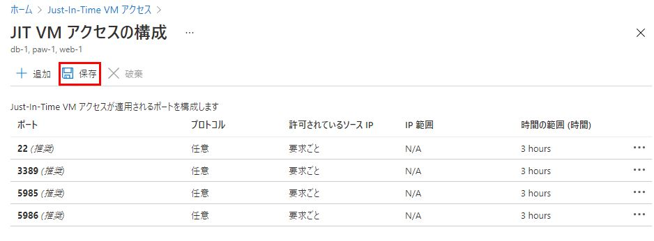

5. 数分後、仮想マシンが**構成済み**タブに移動しているのが確認できるはずです。

    

### Task 2: JITリクエストの実行

1. 仮想マシン**paw-1**を選択し、**アクセス権の要求**を選択します。

    

2. 各ポートの**オン**トグルボタンを選択し、デフォルトのIP設定が**自分のIP**になっていることに注意してください。

    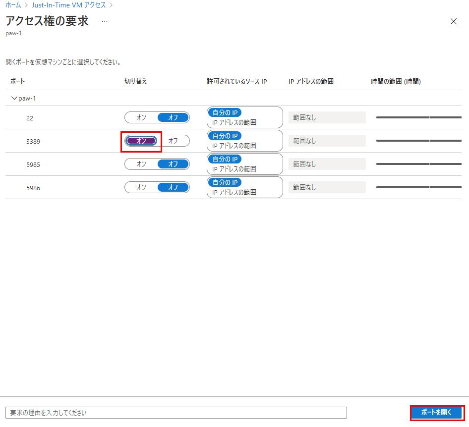

3. ダイアログの下部で、**ポートを開く**を選択します。しばらくすると、**承認済み**のリクエストが増加し、**最終アクセス日時**が**現在アクティブ**に設定されていることが確認できるはずです。

    

    > **Note**:  ARMテンプレートでVMと仮想ネットワークが完全にプロビジョニングされるのを待たなかった場合、エラーが発生する可能性があります。

4. 三点メニューを選択し、**アクティビティ ログ**を選択すると、仮想マシンへのアクセスを要求した人の履歴が表示されます。

    

    > **Note**: これらのエントリは、VMを削除した後も存続します。VMを削除した後は、手動で削除する必要があります。


5. Azure Portal のメインメニューで、**すべてのサービス**を選択し、**ネットワーク**と入力して、**ネットワークセキュリティグループ**を選択します。

    

6. フィルターのテキストボックスに**paw-1-nsg**と入力し、**paw-1-nsg**のネットワークセキュリティグループを選択します。

7. **受信セキュリティ規則**を選択すると、JIT アクセスによって設定された受信セキュリティ規則が表示されます。

    

## Exercise 2: Webアプリケーションとデータベースの保護

Duration: 45 minutes

この演習では、Azure SQLの機能を利用してデータベースデータをデータマスクし、Azure Key Vaultを利用してデータベースを照会するユーザーやアプリケーションの機密カラムを暗号化します。

### Task 1: データベースの設定 (※ データベース設定済みの環境が存在する場合は Task 2 へ)

> **Note**: 講師に確認し、Task 1 の環境が事前に準備されている場合、スキップして [ [Task 2: Webアプリケーションソリューションのテスト](#task-2-webアプリケーションソリューションのテスト) ] に進んでください。

1. Azureポータルに切り替えて、「**すべてのサービス**」を選択し、「**SQL**」を検索します。 **SQL Servers**を選択します。

    

2. Azure Managerテンプレートを使って作成した**Azure SQL**データベースサーバーを選択します（例：azsecurity-xxxx）。

3. 設定 セクションの **SQL データベース** を選択し、**SampleDB** データベースを選択します。

    

4. Summaryセクションで、**データベース接続文字列の表示**を選択します。

    

5. このラボで後述する接続文字列の設定で必要となりますのでNotepadなどにコピーしておいてください。特に**Server**パラメータに注意してください。

    

6. Lab VM (paw-1) で **SQL Server Management Studio** を開きます。

7. 上記のデータベースサーバー名を入力します。

8. Azure テンプレートのデプロイ時に使用したユーザー名とパスワード（**wsadmin** - **p\@ssword1rocks**）を入力します。

    > **Note**: ARMテンプレートのデプロイ時にユーザー名とパスワードを変更した場合は、その値を代わりに使用してください。

    > **Note**: 英語キー配列の場合の入力文字に気をつけてください。

    

9. Azure SQL 環境への接続方法（VNet 内または外）によっては、ファイアウォールルールを追加するよう促される場合があります。このような場合は、以下の操作を行ってください。

    - **Connect**を選択し、**New Firewall Rule**ダイアログで、**Sign in**を選択します。

    - リソースグループオーナーの認証情報を使ってサインインします。

    - ダイアログで、**OK**を選択すると、受信するパブリックIPアドレスが接続用に追加されます。

    

    ※ Firewall Ruleの追加で、エラーが発生する場合は、以下のようにAzureポータルからファイアウォールの設定をしてください。

    

10. **Databases**を右クリックし、**Import Data-tier Application**を選択します。

    

11. **Introduction**ダイアログで、**Next**を選択します。

    

12. **Browse**を選択し、**paw-1** vm の `c:\temp` 配下の  **/Hands-on lab/Database** ディレクトリに移動し、**Insurance.bacpac**ファイルを選択します。

    

13. **Open**を選択します。

14. **Import Settings**ダイアログで、**Next**を選択します。

15. **Database Settings**ダイアログで、**Next**を選択します。

    > **Note**: エラーが発生した場合は、SQL Management Studioを一旦終了し、再度開いてインポートを行ってください。それでもうまくいかない場合は、[こちら](https://docs.microsoft.com/en-us/sql/ssms/download-sql-server-management-studio-ssms?view=sql-server-2017)から最新のSQL Management Studioをダウンロードする必要があるかもしれません。最新版では動作しない場合もありますが、バージョン17.3ではパッケージが正しく展開されることが知られています。 また、一部のSQL Serverインスタンスからエクスポートされたbacpacファイルは、Azure SQL Serverにデプロイできないことにも注意が必要です。 また、Insuranceデータベースの.bakファイルを同梱していますので、復元にご利用ください。

16. **Finish**を選択すると、データベースがAzureにデプロイされます。数分かかる場合があります。

17. 完了したら、**Close**を選択します。

    

18. **SQL Management Studio**で、「File」-「Open」-「File」を選択します。

    

19. **paw-1** vm の `c:\temp` 配下の  GitHub フォルダを参照し、**\Hands-on lab\Database\00_CreateLogin.sql**ファイルを選択します。

20. **master**データベースが選択されていることを確認します。

21. スクリプトを実行して、**agent**という名前のログインを作成します。

22. 再度、SQL Management Studioで、「File」-「Open」-「File」を選択します。

23. **paw-1** vm の `c:\temp` 配下の フォルダを参照し、**\Hands-on lab\Database\01_CreateUser.sql** ファイルを選択してください。

24. **Insurance**データベースが選択されていることを確認します。

25. スクリプトを実行して、**agent**という非管理者ユーザーを作成します。

### Task 2: Webアプリケーションソリューションのテスト

1. Azureポータルで、「**すべてのサービス**」を選択し、「**SQL**」を検索します。 **SQL Servers**を選択します。

    

2. Azure Managerテンプレートを使って作成した**Azure SQL**データベースサーバーを選択します（例：azsecurity-xxxx）。

3. 設定 セクションの **SQL データベース** を選択し、**SampleDB** データベースを選択します。

    

4. Summaryセクションで、**データベース接続文字列の表示**を選択します。

    

5. このラボで後述する接続文字列の設定で必要となりますのでNotepadなどにコピーしておいてください。

    

6. **paw-1** vm の `c:\temp` 配下の ディレクトリの中にある**Hands-on lab\WebApp\InsuranceAPI**というソリューションファイルをダブルクリックすると、Visual Studioが立ち上がります。

    > **Note**: プロンプトが表示されたら、Azure / MSDNアカウントでログインしてください。

7. **ソリューション エクスプローラー**で、**Web.config**ファイルをダブルクリックして開きます。

    

8. **Insurance** データベースを指すように web.config を更新します（13 行目）。接続文字列を更新するため、**value=** の後の **""** の間にコピーした接続文字列を貼り付けます。
    
    > **Note**: 接続文字列の User IDは **agent**、Password は **p@ssword1rocks** に置き換えてください。

    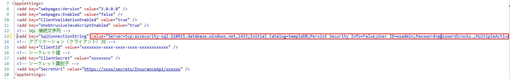

9. **F5**を押して、**InsuranceAPI**ソリューションを実行します。

    > **Note**: Visual Studio の デフォルトブラウザを Chrome に変更するには以下の画像を参照してください。

    > 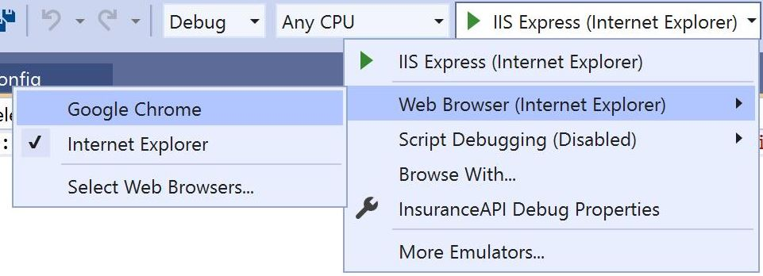


10. Chromeで、`http://localhost:24448/api/Users` にアクセスして、APIの応答をテストします。ポート番号は_24448_と異なるかもしれません。ブラウザにいくつかのレコードが返されるのが見えるはずです。次の命令のために `UserId` の値をコピーしてください。

    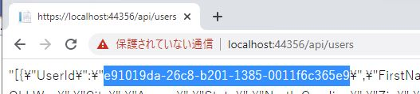

11. 開いたブラウザウィンドウで、`http://localhost:24448/api/Users/e91019da-26c8-b201-1385-0011f6c365e9`をブラウズすると、マスクされていないSSNカラムを示すjsonレスポンスが表示されます。

    > **Note**: お使いのブラウザによっては、json形式のレスポンスを表示するためにダウンロードが必要な場合があります。Chromeでアクセスすることを推奨します。

    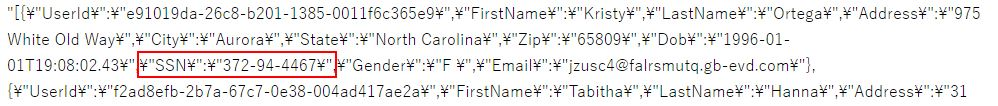

### Task 3: データマスキングの活用

1. Azure Portal に切り替えます。

2. **SQL データベース**を選択します。

3. **Insurance**データベースを選択します。

4. **セキュリティ**の項目で、**動的データマスキング**を選択し、**+ マスクの追加**を選択します。

    

5. **User**テーブルを選択します。

6. **SSN**列を選択します。

7. **追加**を選択します。

    

8. **保存**を選択し、**OK**を選択します。

9. InsuranceAPIソリューションに戻り、**F5**を押してページを更新します。SSNカラムが**xxxx**でマスクされていることが確認できます。

    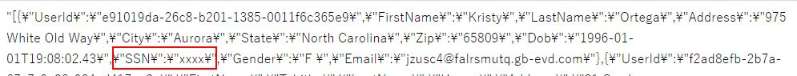

10.  **Visual Studio** を閉じます。

### Task 4: Azure Key Vaultによるカラム暗号化の利用

1. **SQL Management Studio**に切り替えます。

2. **File->Open->File**を選択し、**02\_PermissionSetup.sql**ファイルを開きます。

3. **Insurance**データベースに切り替え、SQL文を実行します。

4. **Object Explorer**で、**Insurance**ノードを展開します。

5. **Tables**ノードを展開します。

6. **User** テーブルノードを展開します。

7. **Columns**ノードを展開します。

8. **SSN**列を右クリックし、**Encrypt Column**を選択します。

    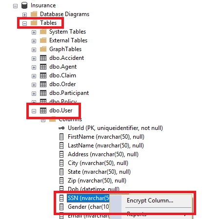

    列の状態は、暗号化（データマスキング）を加えることができないようになっていることに注意してください。

    

9. **Cancel**を選択します。

10. Azure ポータルに戻り、User_SSN データマスキングを選択します。

11. **削除** を選択します。

    

12. **保存**を選択します。

13. **SQL Management Studio**に戻ります。

14. **SSN**列を右クリックし、**Encrypt Column**を選択します。

15. **SSN**欄の横のチェックボックスにチェックを入れます。

16. **Encryption Type**で**Deterministic**を選択します。

    

    > **Deterministic** 暗号化は、与えられた平文の値に対して常に同じ暗号化された値を生成します。Deterministic暗号化を使用すると、暗号化されたカラムに対するポイントルックアップ、等号結合、グループ化、インデックス化が可能になります。しかし、特にTrue/FalseやNorth/South/East/Westのように暗号化された値のセットが少ない場合には、暗号化されたカラムのパターンを調べることで、権限のないユーザーが暗号化された値の情報を推測することができてしまいます。Deterministic暗号化では、文字列の照合順序を binary2 にする必要があります。

    > **Randomized** 暗号化は、予測不可能な方法でデータを暗号化する方法を採用しています。ランダムな暗号化はより安全ですが、暗号化されたカラムでの検索、グループ化、インデックス化、結合ができなくなります。

17. **Next**を選択します。

18. 暗号化には、ダイアログで **Azure Key Vault** を選択します。

    

19. **Sign In**を選択します。

20. Azureポータルの認証情報を使ってサインインします。

21. Azure Key Vault を選択します。

22. **Next**を選択します。

23. **Run Settings**で**Next**を選択します。

24. **Finish**を選択すると、設定が開始されます。

    > **Note**: **Wrap Key**エラーが発生する場合があります。その場合は、Azure Key Vaultでアカウントに**wrapKey**権限が割り当てられていることを確認してください。

    

    - **Key vault**を選択します。

    - 自分のKey Vaultを選択してください。

    - **Access policies**を選択します。

    - **Add New**を選択します。

    - プリンシパルの場合は、アカウントを選択します。

    - **Key permissions**を選択し、**Select all**を選択します。

        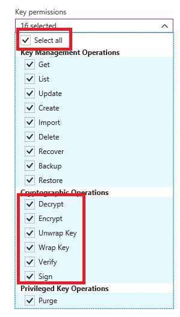

    - **Secret permissions**を選択し、**Select all**を選択します。

    - **Certificate permissions**を選択し、**Select all**を選択します。

    - **OK**を選択します。

    - **Save**を選択します。

    - 操作をやり直します。

    > **Note**: それでもエラー（Access Deniedなど）が発生する場合は、正しいサブスクリプションとKey Vaultを選択しているか確認してください。


    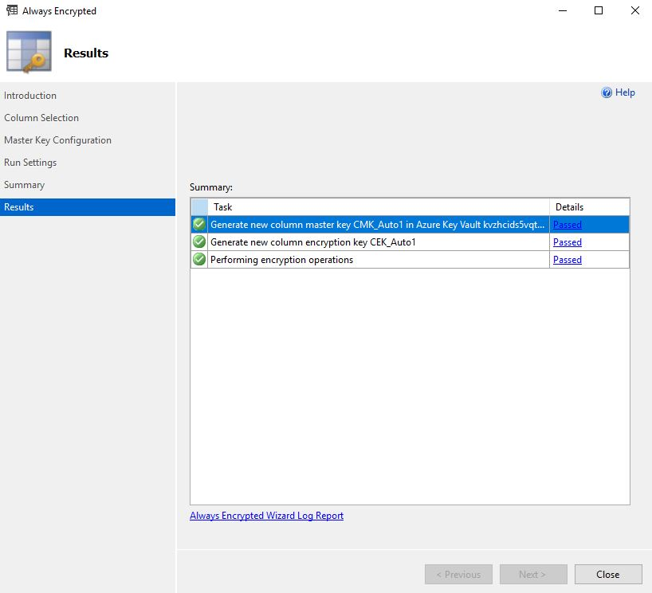

25. **Close**を選択します。

26. **User**テーブルを右クリックし、**Select top 1000 rows** を選択します。

    

    SSNの列が、新しいAzure Key Vaultのキーに基づいて暗号化されていることがわかります。

    

27. Azureポータルに切り替えます。

28. **Key Vaults**を選択します。

29. Azure Key Vault を選択して、「**Keys**」を選択します。SQL Management Studioから作成されたキーが表示されるはずです。

    

## Exercise 3: Migrating to Azure Key Vault

Duration: 30 minutes

この演習では、アプリケーションの構成ファイルに重要な認証情報（接続文字列など）を保存するのではなく、Azure Key Vaultを利用するようにWebアプリケーションを移行する方法を学びます。

### Task 1: Azure Key Vaultのシークレットの作成

1. 自分のAzureポータルに切り替えます。

2. **キーコンテナー**を選択し、Azure Key Vaultを選択します。

    
    

3. **シークレット**を選択し、**+ 生成/インポート**を選択します。

    

4. **アップロードオプション**で、 **手動**.を選択します。

5. **名前**には、**InsuranceAPI** と入力します。

6. **値**には、Exercise 2の**InsuranceAPI**ソリューションのWeb.configファイルから接続文字列情報をコピーします。(value="" のダブルクォーテーションの間の文字列)

7. **作成**を選択します。

8. **シークレット**を選択します。

9.  **InsuranceAPI**を選択します。

10. 現在のバージョンを選択します。

    

11. 後で使用するために、シークレット識別子のURLをコピーして記録します。

    

### Task 2: Azure Active Directoryアプリケーションの作成

1. Azure Portalで、**Azure Active Directory**を選択し、**アプリの登録**を選択します。

    
    

2. **+ 新規登録** を選択します。

3. ユーザー向け表示名には、**AzureKeyVaultTest** と入力します。

4. 対応しているアカウントについては、**この組織ディレクトリ内のみに含まれるアカウント (既定のディレクトリ のみ - シングル テナント)** を選択します。

5. リダイレクトURLには、 **http://localhost:12345** を入力します。

    

6. **登録**を選択します。

7. **アプリケーションID**をコピーして記録します。

    

8. 左側のメニューペインの**管理**の見出しの下で、**証明書とシークレット**リンクを選択します。

9.  **クライアントシークレット**の下の **新しいクライアントシークレット**を選択します。

    

10. 説明には **InsuranceAPI** と入力します。

11. 有効期限は**12ヶ月**を選択。

12. **追加**を選択します。

13. キーの値をコピーして記録し、後で使用できるようにします。

### Task 3: Azure Active Directoryのアプリケーション権限の割り当て

1. Azure Portal に戻って、Azure Key Vault を選択します。

2. **設定**の項目で **アクセス ポリシー**を選択します。

3. **+ アクセス ポリシーの追加**を選択します。

    

4. **プリンシパルの選択**フィールドの値を選択します。右側のペインで、**AzureKeyVaultTest** と入力します。項目を選択します。

5. 下部にある**選択**ボタンを選択します。

6. **シークレットのアクセス許可**のドロップダウンを選択し、**取得**と**一覧**のパーミッションをチェックします。

    

    選択肢は以下のようになります。

    

7. **追加**ボタンを選択します。

8. 上部の**保存**ボタンを選択します。

### Task 4: NuGetパッケージのインストールまたは検証

1. **paw-1** vmで、先ほどの Visual Studio ソリューションを終了し、`c:\temp` 配下の  GitHub ディレクトリから、 **\Hands-on lab\WebApp\InsuranceAPI\InsuranceAPI.sln** ソリューションを開きます。

    >**Note**:  必ず正しいソリューションを開き直してください。

    

2. **Visual Studio**に切り替えます。

3. メニューの中の、**View-\>Other Windows-\>Package Manager Console**を選択します。

4. 開いた新しいウィンドウで、以下のコマンドを実行します。

    ```PowerShell
    Install-Package Microsoft.CodeDom.Providers.DotNetCompilerPlatform
    ```

    ```PowerShell
    Install-Package Microsoft.IdentityModel.Clients.ActiveDirectory -Version 2.16.204221202
    ```

    ```PowerShell
    Install-Package Microsoft.Azure.KeyVault
    ```

    > **Note**: これらはすでにプロジェクト内に存在していますが、参照用として提供されています。デバッグ時にcodedomバージョンエラーが発生する場合は、このコマンドを実行してください。

    ```PowerShell
    Update-Package Microsoft.CodeDom.Providers.DotNetCompilerPlatform -r
    ```

5. **ソリューションエクスプローラー**から、**Web.config**ファイルをダブルクリックして開きます。

    **appSettings**セクションには、いくつかのトークン値があることに注目してください。

    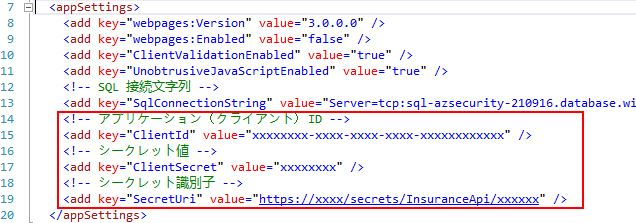

6. **アプリケーション**(**クライアント**)**ID** と **シークレット値** をTask 2でコピーした値に置き換えてください。

    

7. **シークレット識別子** をTask 1でコピーした Azure Key Vault のシークレット識別子に置き換えます。

8. UsersController.cs を開き、 16 行目をコメント、17 行目をコメント解除します。(接続文字列をKey Vaultのシークレットから取得するように変更)

9. Global.asax.cs を開き、34-41 行目のコメントを解除します。

10. Visual StudioでWeb.configファイルを保存します。

    > **Note**:  このラボを一歩進めて、Web App を Azure App Service に公開し、[システム割り当て マネージドID](https://docs.microsoft.com/ja-jp/azure/app-service/overview-managed-identity?tabs=dotnet)を有効にすることができます。  これにより、設定から認証情報を完全に取り除き、[Key Vault 参照](https://docs.microsoft.com/ja-jp/azure/app-service/app-service-key-vault-references)を利用することができます。

### Task 5: ソリューションのテスト

1. **UserControllers.cs** ファイルを開き、17行目にブレークポイントを置きます。(F9 キー)

    > **Note**: このコードでは、上記で設定したアプリケーションのアクセストークンを取得するための呼び出しを行い、そのアクセストークンを使ってAzure Key Vaultを呼び出しています。

2. **F5**を押して、ソリューションを実行します。

3. アプリケーションが表示されたら、[http://localhost:portno/api/Users](http://localhost:portno/api/Users) にナビゲートします。

    Azure Key Vaultへの呼び出しが実行され、シークレット（ここではAzure Databaseへの接続文字列）が返されているのがわかるはずです。

    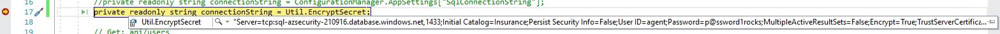


4. ###要修正 **F5**を押して、プログラムを続行すると、エラーが表示されるはずです。前の演習で列を暗号化したため、EntityFrameworkはデフォルトの設定を使用して値（複数可）を取得することができません。シームレスな復号化を行うためには、以下のことが必要です。

    > **Note**: 以下本ワークショップでは実施する必要はありません。時間があるときにお試しください。

    - まだ実行していない場合は、**\\Hands-on lab\\Database\\02\_PermissionSetup.sql**スクリプトを実行してください。

    - プロジェクトに[AzureKeyVaultProvider for Entity Framework](https://blogs.msdn.microsoft.com/sqlsecurity/2015/11/10/using-the-azure-key-vault-key-store-provider-for-always-encrypted/)の参照を追加します。

    - .NETで暗号化されたカラムを処理するために、プロバイダコードを登録します。
  
    - Azure Key Vault に、Azure AD アプリケーションにキーのパーミッション（`decrypt`、`sign`、`get`、`unwrapkey`、`verify`）を与えるアクセスポリシーを追加します。

    - 接続文字列に`Column Encryption Setting=Enabled`を追加します。

    - 詳しい手順はこちらの[ブログ記事](https://docs.microsoft.com/en-us/archive/blogs/sqlsecurity/using-the-azure-key-vault-key-store-provider-for-always-encrypted)をご覧ください。

    - 3つ目のソリューション（**\\Hands-on lab\\WebApp\\InsuranceAPI\_KeyVault\_Encrypted\\InsuranceAPI.sln**）は、GitHub repoに必要なリファレンスとコードが追加されています。 

  
      - 上記の Key Vault パーミッションを追加した後、クライアント ID とシークレットで web.config ファイルを更新してください。
  
      - Key Vaultの接続文字列を更新して、`Column Encryption Setting=Enabled`とします。

      - global.asax.csファイルに追加されたコードを確認します。

      - プロジェクトを実行し、上記のページに移動します。

## Exercise 4: ネットワークの保護

Duration: 45 minutes

この演習では、ネットワークセキュリティグループを利用して、仮想マシンが他のAzureホストサービスから分離されていることを確認した後、Azureのネットワークパケットキャプチャ機能を使用して、ネットワーク間のトラフィックを積極的に監視します。

### Task 1: ネットワークセキュリティのグループルールのテスト \#1

1. Azureポータルで、**Virtual Machines**を選択します。

2. **paw-1**を選択し、**接続**を選択します。 

3. ダイアログが表示されますので、「**Download RDP file Anyway**」を選択します。 ダウンロードしたRDPファイルを開き、仮想マシンに接続します。

    > **Note**: デフォルトのユーザー名は **wsadmin** 、パスワードは **p\@ssword1rocks** です。演習の合間に休憩を取った場合は、JITアクセスを要求する必要があります。

4. **paw-1**の仮想マシンで、**administrator**として**Windows PowerShell ISE**を開きます。

    - **Windows**のアイコンを選択します。

    - **Windows PowerShell ISE**を右クリックし、**More**を選択し、**Run as Administrator**を選択します。

5. 以下のコマンドをコピーして実行します。

    ```PowerShell
    Set-ExecutionPolicy -ExecutionPolicy Unrestricted
    ```

    

6. ダイアログでは、**Yes**を選択します。

7. **File->Open**を選択し、**paw-1** vm の `c:\temp` 配下の GitHubのディレクトリを参照して、**\Hands-on lab\Scripts\PortScanner.ps1**を開きます。

    > **Note**: 事前準備で、[GitHub repo](https://github.com/Microsoft/MCW-Azure-Security-Privacy-and-Compliance)をダウンロードして、セットアップの手順でこれを展開したと思います。 これらの手順を実行していない場合は、今すぐ実行してください。また、デスクトップからVMにファイルをコピーすることもできます。

8. スクリプトを確認します。このスクリプトでは、様々な練習問題に対して以下のことが行われていることに注目してください。

   - Putty をインストールします。

   - NotePad++ をインストールします。

   - DNS用のHostsエントリーを追加

   > **Note**: 複数の仮想ネットワークを使用する場合は、Azure テナントに DNS サーバーを設定する必要があります。

    > **Note**: スクリプトの645行目のputtyのバージョンが古い場合、最新のバージョンに変更してください。(2021年8月時点では0.76)

   - ポートスキャンの実行

   - ブルートフォースSSH攻撃の実行

9. **F5**を押して Exercise 4のスクリプトを実行します。以下のように表示されるはずです。

    > **Note**:  ARMテンプレートでは、Deny Allルールを展開します。 単にUIからネットワークセキュリティグループを作成しただけでは、このような動作は発生しません。

    - **paw-1**マシンから**db-1**および**web-1**への3389番ポート(RDP)のポートスキャンが失敗しました。

    - 上記のポート3389（RDP）の情報は、スクリプトを実行して**F5**を押すと表示されます。

    

    - **paw-1**マシンから**db-1**および**web-1**へのポート1433（SQL）のポートスキャンが失敗しました。**db-1**はSQL Serverを実行していますが、トラフィックはNSGおよびWindowsファイアウォール経由でデフォルトでブロックされています。しかし、ARMテンプレート内でdb-1サーバの1433ポートを開くスクリプトが実行されました。

    

    - **paw-1**マシンから**db-1**および**web-1**への80番ポート（HTTP）のポートスキャンが失敗しています。トラフィックが許可されている場合、**db-1**にはIISやその他のWebサーバーが稼動していないため、常に失敗します。

    

### Task 2: ネットワークセキュリティグループの設定

1. [Azure ポータル](https://portal.azure.com)に切り替えます。

2. WebサーバーからのSQL接続のみを許可するようにデータベースサーバーを設定します。

   - **ネットワーク セキュリティ グループ** を選択します。

   - **DbTrafficOnly** を選択します。

   - **受信セキュリティ規則** を選択します。

   - **+ 追加** を選択します。

   - **ソース** に **IP Addresses** を選択します。

   - **ソース IP アドレス**に **10.2.0.4** (Web-1のアドレス) を入力します。
  
   - **宛先** を **Any** のままにします。

   - **宛先ポート範囲** に **1433** を入力します。

   - **優先度** に **100** を入力します。

   - **名前** に **Port_1433** を入力します。

   - **追加** を選択します。

   - **+ 追加** を選択します。

   - **ソース** に **IP Addresses** を選択します。

   - **ソース IP アドレス** に **10.0.0.5** (paw-1のアドレス) を入力します。
  
   - **宛先** を **Any** のままにします。

   - **宛先ポート範囲** に **1433** を入力します。

   - **優先度** に **102** を入力します。

   - **名前** に **Port_1433_Paw** を入力します。

   - **追加** を選択します。

3. すべてのHTTPおよびHTTPS接続を許可するようにWebサーバーを設定する。

   - **ネットワーク セキュリティ グループ** を選択します。

   - **WebTrafficOnly** を選択します。

   - **受信セキュリティ規則** を選択します。

   - **+ 追加** を選択します。

   - **ソース** を **Any** のままにします。

   - **宛先** を **Any** のままにします。

   - **宛先ポート範囲** に **80,443** を入力します。

   - **優先度** に **100** を入力します。

   - **名前** を **Port\_80\_443** に変更します。

   - **追加** を選択します。

   > **Note**: まれに、ネットワークセキュリティグループのステータスが**更新中**から変更されるまでに15分程度かかる場合があります。 この変更が完了するまで、他のルールを追加することはできません。

4. データベースとWebサーバーの両方で、PAWマシンからのRDP接続のみを許可するように設定します。

    - **ネットワーク セキュリティ グループ**を選択します。**DbTrafficOnly** と **WebTrafficOnly** の両方について、以下の操作を行います。

       - **受信セキュリティ規則** を選択します。

       - **+ 追加** を選択します。

       - **ソース** に **IP Addresses** を選択します。

       - **ソース IP アドレス** に **10.0.0.5** (paw-1のアドレス) を入力します。

       - **宛先ポート範囲** に **3389** を入力します。

       - **優先度** に **101** を入力します。

       - **名前** に **Port_3389** を入力します。

       - **追加** を選択します。

5. すべてのネットワークセキュリティグループの診断ログを有効にする。

    - **ネットワーク セキュリティ グループ** を選択します。 各NSG（DBTrafficOnly、WebTrafficOnly）について、以下を行います。

       - コンテンツメニューで**診断設定** を選択し、**+ 診断設定を追加する** を選択します。

        

      - 名前にはNSGの名前を入力し、最後に**Logging**を付けます。

      - **Log Analytics ワークスペースへの送信** チェックボックスをチェックし、**Log Analytics**ボックスで、**Configure**を選択します。

      - ワークスペースの**azseclog...**を選択します。

      - LOGのチェックボックスを両方とも選択します。

      - **保存** を選択します。

       

### Task 3: ネットワークセキュリティのグループルールのテスト \#2

1. **paw-1**の仮想マシンに切り替えます。

2. **F5** を押して、**PortScan**スクリプトを実行します。以下のように表示されるはずです。

    - **paw-1**マシンから**web-1**および**db-1**への3389番ポート（RDP）のポートスキャンに成功しました。

    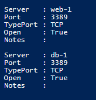

    - paw-1**マシンから**db-1**への1433番ポート（SQL）のポートスキャンは成功し、**web-1**は失敗しています。

    > **Note**: ARMスクリプトが失敗した場合、この結果を得るためには、db-1サーバーのWindowsファイアウォールを無効にする必要があるかもしれません。

    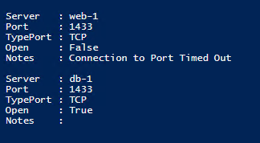

    - **Note**: ARMテンプレートは、web-1にIISをインストールしました。**paw-1**マシンから**web-1**への80番ポート（HTTP）のポートスキャンは成功しましたが、**db-1**にはIISが動作していないため失敗しました。

    

### Task 4: ネットワークウォッチャーVM拡張機能のインストール

1. Azureポータルに切り替えます。

2. **Virtual Machines** を選択します。

3. **db-1** を選択します。

4. ブレードメニューで **拡張機能** を選択し、 **+ 追加** を選択します。

    

5. **Network Watcher Agent for Windows** を参照し、選択します。(見つからない場合、スクロールして **さらに読み込む** を選択します。)

6. **次へ** を選択します。 **確認と作成** を選択します。 **作成** を選択します。

    

7. 次の**拡張機能のインストール** ダイアログウィンドウ（空白の場合もあります）で**OK** を選択します。仮想マシンにスクリプト拡張がインストールされたことを通知するダイアログトーストが表示されます。

    

### Task 5: ネットワークパケットキャプチャの設定

1. Azureポータルのメインメニューで、**すべてのサービス**から**Network Watcher**を検索します。

2. コンテキストメニューで**Network Watcher**を選択します。

    

3. **+ 追加** ボタンを選択します。 ラボを実行しているサブスクリプション地域の項目を展開します。

4. **東日本** リージョン（またはVMをデプロイしたリージョン）では、省略記号を選択し、「**Enable network watcher**」を選択します。(すでにVMをデプロしたリージョンのリソースが存在する場合は、ステップ5へ進みます。)

    

5. 新しいコンテキストメニューで、**パケットキャプチャ** を選択します。

6. **+ 追加** を選択します。

    

7. サブスクリプションを選択します。

8. リソースグループを選択します。

9.  対象となる仮想マシンに **db-1** が選択されていることを確認します。

10. キャプチャー名には **databasetraffic** と入力します。

11. キャプチャーファイルをローカルマシンまたはAzureストレージアカウントに保存できることに注目してください。リソースグループのストレージアカウントが選択されていることを確認します。 リソースグループを確認すると、ストレージアカウントの先頭に **"diagstor "** が付いています。

12. 値は以下のように入力します。

    - 1 パケットあたりの最大バイト数: 0.
    - 1 セッションあたりの最大バイト数: 1073741824.
    - 制限時間: 600.

    

13. **保存** を選択します。

### Task 6: ポートスキャンの実行

1. リモートデスクトップの接続先を、**paw-1** 仮想マシンに切り替えます。

2. スクリプトの次の行をアンコメントして、**F5**を押します。(この行が存在しない場合、追加してアンコメントします。)

    ```PowerShell
    #TestPortRange $computers 80 443;
    ```

   

    > **Note**: 基本的なポートがスキャンされ、次に80から443までのポートスキャンが行われるはずです。これにより、ネットワークセキュリティグループのセキュリティセンターログが多数生成され、次の演習課題のカスタムアラートで使用されます。スクリプトが実行されている間、次の演習に進みます。

## Exercise 5: Azure Security Center

Duration: 45 minutes

Azure Security Centerは、デフォルトでは有効になっていないいくつかの高度なセキュリティおよび脅威検出機能を提供します。この演習では、そのうちのいくつかを調べて有効にします。

### Task 1: Linux VMとMicrosoft Monitoring Agent（MMA）のインストール

1. Azure Portalで、**azsecurity-xxxx** リソースグループを参照して、*azseclog...* **Log Analytics Workspace**を選択します。

    

2. ブレードで **エージェント管理** を選択します。

3. 後で利用するため、**ワークスペースID** と **主キー** の値を記録します。

   

4. リモートデスクトップ接続で**paw-1**に切り替えます。

5. **Putty**ツールを開き、ユーザー名とパスワードを使って **linux-1** マシンにログインします。
(事前に paw-1 のhostsファイル (C:\Windows\System32\drivers\etc\hosts) を確認し、VMのIPアドレスが間違っている場合は、修正してください。)

   

1. ワークスペースID・主キーを上記で記録した値で置き換え以下のコマンドを実行します。:

    ```bash
    wget https://raw.githubusercontent.com/Microsoft/OMS-Agent-for-Linux/master/installer/scripts/onboard_agent.sh && sh onboard_agent.sh -w <YOUR_WORKSPACE_ID> -s <YOUR_WORKSPACE_KEY>

    sudo /opt/microsoft/omsagent/bin/service_control restart <YOUR_WORKSPACE_ID>

    ```

2. Azureポータルから Log Analytics ワークスペースに戻ります。

3. ブレードメニューで **エージェント管理** を選択し、**Linux  サーバー** タブを選択、 **1 台の Linux コンピューターが接続されています** と表示されていることを確認します。

   

   > **Note**: ほとんどの場合、Azureはリソースグループのログ分析ワークスペースにリソースを自動的に割り当てます。

### Task 2: ブルートフォースアタックの実行

1. リモートデスクトップ接続で、**paw-1**に切り替えます。

2. PowerShell ISEで、Exercise 4の行をコメントし、Exercise 5の行をアンコメントします。

3. スクリプトを実行すると、puttyからplinkツールを使って**linux-1**マシンにSSHでログインしようとする試みが何度か実行されることに注目してください。

4. しばらくすると（最大30分）、ブルートフォース攻撃が成功したことを示すSecurity Centerのアラートが表示されます。

    


### Task 3: 変更追跡と更新管理を有効にする

1. Azureポータルに戻ります。

2. Automation アカウントを選択します。

3. **インベントリ**を選択し、Log Analyticsの**サブスクリプション**、**ワークスペース**を選択し、**有効化**を選択します。

   

4. **更新プログラムの管理**を選択し、Log Analyticsの**サブスクリプション**、**ワークスペース**、**Azutomation アカウント**を確認し、**有効化**を選択します。

   

5. **インベントリ**を選択し、**+ Azure VM の追加** を選択します。

   

6. **paw-1**, **db-1**, **linux-1**, **web-1** をチェックし、**有効化** を選択します。

   

7. Automation アカウントに戻り、**更新プログラムの管理**を選択し、**+ Azure VM の追加** を選択します。

    

8. サブスクリプション、リージョン、リソースグループを確認、適切なLog Analytics ワークスペースとAzutomation アカウントが表示されていることを確認、**paw-1**, **db-1**, **linux-1**, **web-1** をチェックし、**有効化** を選択します。

    

9. リソースグループを参照して、Log Analyticsワークスペースを選択します。

10. **全般**セクションで、**ソリューション**ブレードを選択すると、**ChangeTracking**と**Updates**ソリューションがワークスペースに追加されていることがわかります。**ChangeTracking**ソリューションを選択します。

    


### Task 4: MMA構成の見直し

1. リモートデスクトップ接続で、**paw-1**に切り替えます。

2. **Event Viewer** を開きます。

3. **Applications and Services Logs**を展開して、**Operations Manager**を選択します。

4. **Operation Manager** を右クリックし、**Filter Current Logs** を選択します。

    

5. イベントIDに「**5002**」と入力し、最新のエントリを選択すると、先ほど追加したものを含め、Log Analyticsワークスペースに展開されているすべてのソリューションに似た名前が表示されます。

    

6. **Windows Explorer**を開き、**C:\Program Files\Microsoft Monitoring Agent\Agent\Health Service State\Management Packs** フォルダを参照します。

7. Azure Portalからデプロイした機能に対応するマネジメントパックがダウンロードされていることを確認してください。

    


## Exercise 6: Azure Sentinelのログとレポート

Duration: 20 minutes

この演習では、Azure Sentinelを設定して、ロギングワークスペースを指すようにし、Azure Runbookを実行するカスタムアラートを作成します。

### Task 1: ダッシュボードの作成

1. Azureポータルを開きます。

2. **すべてのサービス** を選択し、「Sentinel」と入力し、「Azure Sentinel」を選択します。
3. **Azure Sentinel の作成** を選択します。

    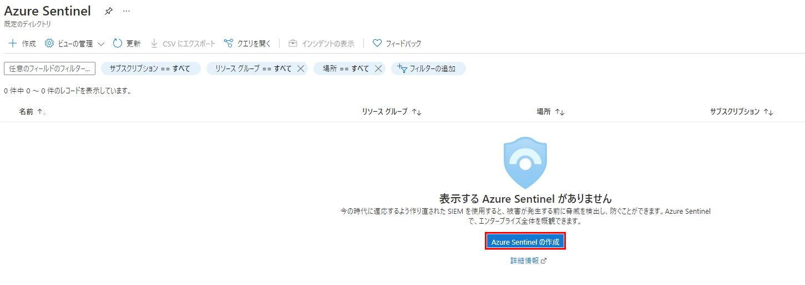

4. リソースグループの **Log Analytics** ワークスペースを選択し、**追加** を選択します。Sentinelのデプロイに数分掛かります。

   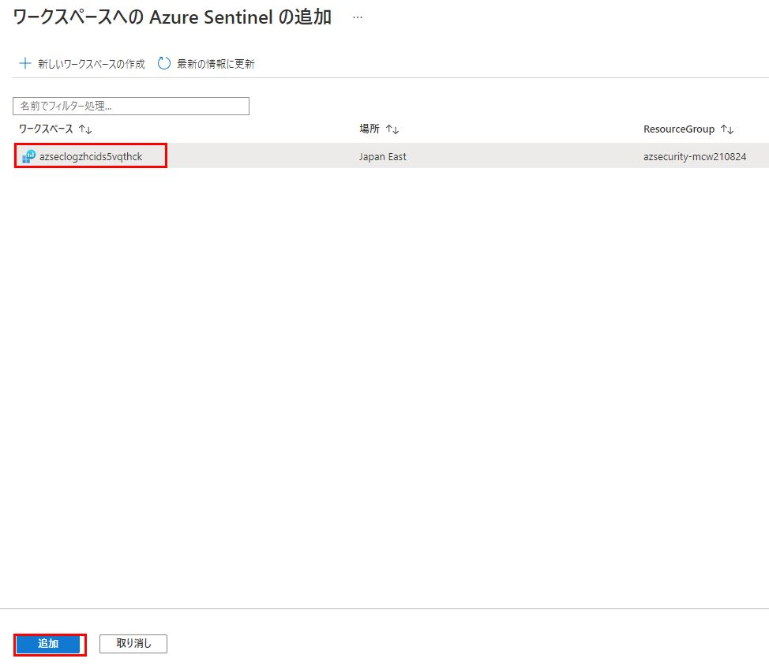

5. ブレード内の「**驚異管理**」セクションで「**ブック**」を選択します。

6. テンプレートの一覧で、「**Azure AD 監査ログ**」を選択し、「**保存**」を選択します。

7. リージョンを選択し、「**OK**」を選択します。

    

8. テンプレートの一覧で、**Azure Network Watcher**を選択し、**保存**を選択します。

9. リージョンを選択し、「**OK**」を選択します。

10. **保存されたブックの表示** を選択し、新しいワークブックを確認します。

    > **Note**: 対象となるワークブックのクエリのログ分析ワークスペースにデータがない場合があります。

### Task 2: 分析アラートの作成

1. **Azure Sentinel**のワークスペースに戻り、**構成**ブレードのセクションで、**分析**を選択し、**+ 作成**を選択し、**スケジュール済みクエリ ルール** を選択します。

    

2. **全体**タブで、名前に「**PortScans**」と入力します。

3. 説明には、**A custom rule to detect port scans**と入力し、**次: ルールのロジックを設定** を選択します。

4. **ルールのクエリ** のテキストボックスに、次のように入力します。

    ```PowerShell
    AzureDiagnostics
    | where ruleName_s == 'UserRule_DenyAll' and Type != 'AzureMetric' and type_s == 'block' and direction_s == 'In' and OperationName == 'NetworkSecurityGroupCounters'
    | summarize AggregatedValue = sum(matchedConnections_d) by ruleName_s, primaryIPv4Address_s
    | where AggregatedValue > 0
    ```

    > **Note**: 特定のNSGを対象にしたい場合は `and Resource == 'WEBTRAFFICONLY'` をクエリに追加します。

    

    > **Note**: ラボでの作業が早かった場合、**AzureMetric** に対応するログデータがLog Analyticsワークスペースにまだないかもしれません。クエリが実行されるまで、15～30分ほど待つ必要があるかもしれません。

    > **Note**: Azure Security CenterとSentinelが導入されてから、バックエンドのロギングが何度か変更され、また、ルールクエリで行われる計算方法も変更されました（クエリ内の時間対クエリ外の時間など）。このクエリの最終的な目的は、ネットワーク・セキュリティ・グループと特定の拒否ルールに対して一連の接続失敗が行われたときに見つけることです。前回公開したラボから何らかの理由で UI/バックエンドが変更された場合は、この目標を達成するためにクエリを変更してください。

5. **エンティティ マッピング** の下で、 **IP** に、 **primaryIPv4Address_s** 列を選択します。 その後 **Add** を選択します。

6. Under **クエリのスケジュール設定** の下で、**クエリの実行間隔** 設定に **5** 分を選択します。

    >**Note**:  これはラボであり、できるだけ早く結果を見たいと思っています。本番環境では、別の時間閾値を選択するとよいでしょう。

7. **次の時間分の過去のデータを参照します** に **2** 時間を設定します。

8. **アラートのしきい値** 、 **クエリ結果件数でアラートを生成する**に、**0** を入力します。

    > **Note:** 実験のために、すぐに閾値を超えるように設定しています。このクエリと値は本番環境では適切ではない可能性があり、学習目的にのみ使用されます。

    **現在のデータでテストする**を選択し、現在のデータを確認します。何がアラートのトリガーになるかを判断します。 赤いしきい値の線が青いイベントデータの線と交差していることに注目してください。

    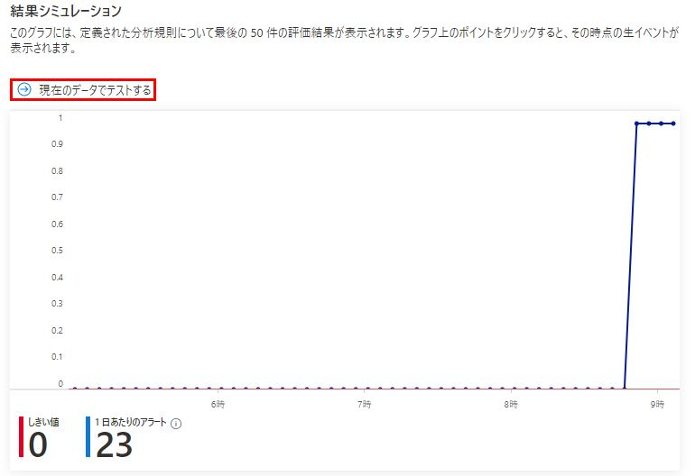

9. **次: インシデントの設定 (プレビュー)** を選択し、インシデントのある設定を確認します。

10. **次: 自動応答** を選択します。まだ選択できるプレイブックがないことをご注意ください。

11. **次: レビュー** を選択します。

12. **作成** を選択します。

    > **Note**:  アラートが出るまでに数分かかることがあります。 PortScanスクリプトを**paw-1**から何度か実行する必要があるかもしれません。

    

### Task 3: カスタムアラートのインシデントを調査する

1. メインメニューで「**Azure Sentinel**」を選択します。

2. **インシデント** を選択します。

3. 新しい**PortScans**インシデントを選択します。

    

    > **Note**: アラートが生成されるまでに15～20分かかることがあります。ポートスキャンスクリプトの実行を継続してログイベントを発生させるか、カスタムアラートの閾値を下げることができます。

4. ダイアログで**すべての詳細を表示**、**調査**を選択します。なお、このボタンが利用可能になるまでには数分かかることがあります。

    
    

5. 今後のバージョンでは、アラートに関する洞察や、発報の原因に関連するリソースを見ることができます。

    


### Task 4: Power BIでのレポート作成

1. **Azure Sentinel**のブラウザウィンドウに戻ります。 **ログ** を選択します。

    >**Note**: ブレードに**Log Analytics へようこそ**のスプラッシュページが表示される場合があります。 **X** を選択し閉じます。

    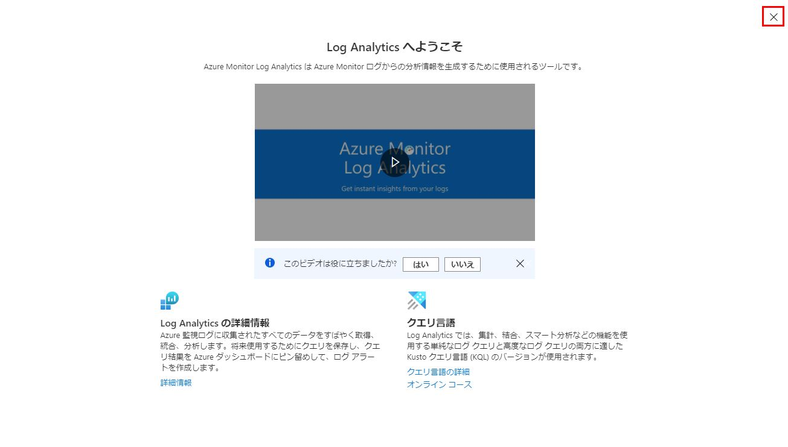

2. **テーブル** タブ の下にある **LogManagement** ノードを展開します。

3. **AzureDiagnostics** をダブルクリック 、次に **実行** をクリックします。

4. 右上の「**エクスポート**」を選択し、「**Power BI へエクスポート (M Query)**」のリンクを選択します。

    

    

5. **開く** を選択すると、Power Query M Languageを使用したテキストドキュメントが表示されます。

    

6. テキストドキュメントの指示に従って、Power BI Desktopでクエリを実行します。(Power BIがローカルのPCにインストールされていない場合は、ラボ環境の **dsvm-vm** にインストールされているものを利用できます。 )

    > **Note**: クエリー実行時の資格情報には**組織アカウント** を使用してください。講師にAzure Passの管理者ID、Passを聞いてください。

7. Power BI Desktopで、**データを取得** -> **空のクエリ** -> **詳細エディター** を選択し、テキストドキュメントのクエリ部分をコピー&ペーストし、**完了** を選択します。

    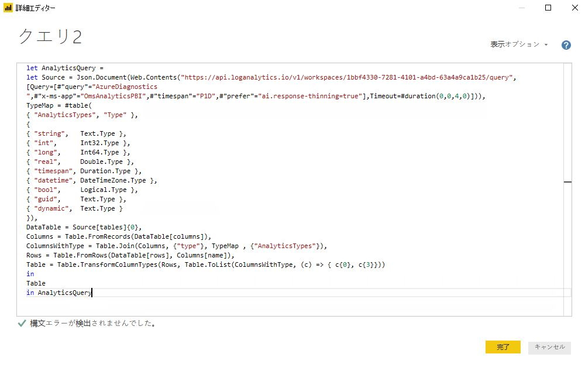

8. **閉じて適用** を選択します。

    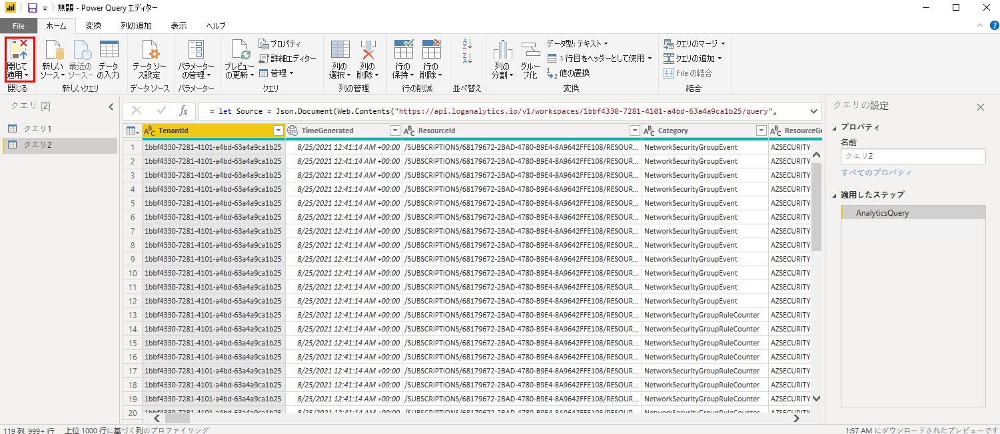

9.  クエリーで取得されたフィールド、データを確認し、**Power BI** を閉じます。
    
## Exercise 7: コンプライアンスツール（Azure Policy、Secure Score）の使用について

Duration: 15 minutes

この演習では、Azureの「Azure Policy」と「Secure Score」の機能をナビゲートする方法を学びます。 また、特定のコンプライアンスポリシーを達成しようとする際に考慮すべき有用なタスクを提供する Compliance Manager ポータルを探索します。

### Task 1: Review a basic Azure Policy

1. [Azure Portal](https://portal.azure.com) を開きます。 **すべてのサービス** を選択し、「**ポリシー**」と入力します。 項目の一覧から「**ポリシー**」を選択します。

   

2. ブレードメニューの**コンプライアンス** を選択し、**リソースの全体的なコンプライアンス** のパーセンテージを確認します。

   

3. スコープについては、適切なサブスクリプションが選択されていることを確認し、「**ASC Default (subscription:**)」を選択します。

4. **イニシアティブ コンプライアンス** ブレードでは、コンプライアンスの指標を確認します。


5. 結果エリアにスクロールし、**準拠していないリソース** タブを選択します。

    

6. フィルター検索ボックスに「**paw-1**」と入力し、表示されたら選択します。

    > **Note**: すぐにリソースが表示されない場合があります。 その場合は、他の非準拠のリソースをスクロールしてください。

7. **ポリシー** タブを選択して、リソースが準拠していないポリシーを確認します。

    >**Note**: 新しいポリシーが作成されるため、あなたの番号は下の画像とは異なる可能性があります。

    

8. ポリシーの1つを選択します。 ポリシーの**定義の表示**のJSONの定義を確認すると、ARMテンプレート形式に基づいており、準拠していないリソースに設定される特定のプロパティを探していることがわかります。

    

    > **Note**: これらのout of boxなテンプレートを使って独自のポリシーを構築し、ブループリントとして適用することができます。

### Task 2: Azure ブループリントの確認と作成

1. ポリシーブレードの「**作成**」の下にある「**定義**」を選択します。 これは、サブスクリプションリソースに割り当てるために選択できる、すべての定義済みポリシーのリストです。

    

2. ポリシーブレードの「**関連サービス**」で「**ブループリント**」を選択します。

3. ブループリントブレードで、**ブループリントの定義**を選択します。

4. **+ ブループリントの作成** を選択します。

    

5. サンプルの設計図を見て、**空白のプループリントで始める** を選択します。

    

6. 名前には「**GDPRBluePrint**」と入力します。

7. 場所については、三点メニューを選択し、ドロップダウンでサブスクリプションを選択します。

8. **選択** を選びます。

    

9. **次へ: 成果物** を選択します。

10. **+ 成果物の追加** を選択します。

11. 成果物の種類 では、**ポリシーの割り当て**を選択し、利用可能なすべてのポリシーを確認します（この記事の執筆時点では、34の定義と755のポリシーが表示されています）。

12. 検索ボックスで **制限** を入力、 **ストレージ アカウントではネットワークアクセスを制限する必要があります** を選択します。

    

    > **Note**: 上記の定義が利用できない場合は、独自の定義を選択してください。

13. **追加** を選択します。

14. **下書きの保存** を選択します。 数分かかる場合があります。 保存操作が終了すると、自動的にブレードが変更されます。

15. 新しいブループリントでは、三点メニューを選択してから **ブループリントを発行する** を選択します。

    

16. バージョンは、**1.0.0** と入力してください。

17. **公開** を選択します。

18. 新しいブループリントでは、三点メニューを選択してから **ブループリントの割り当て** を選択します。

    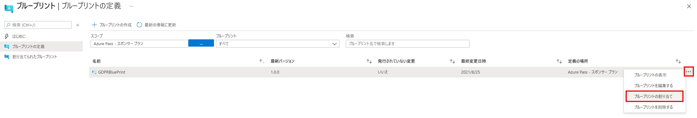

19. リソースグループを選択して、**割り当て** を選択します。 このポリシーは、特定のサブスクリプションのすべてのストレージアカウントに対して監査されるようになります。

    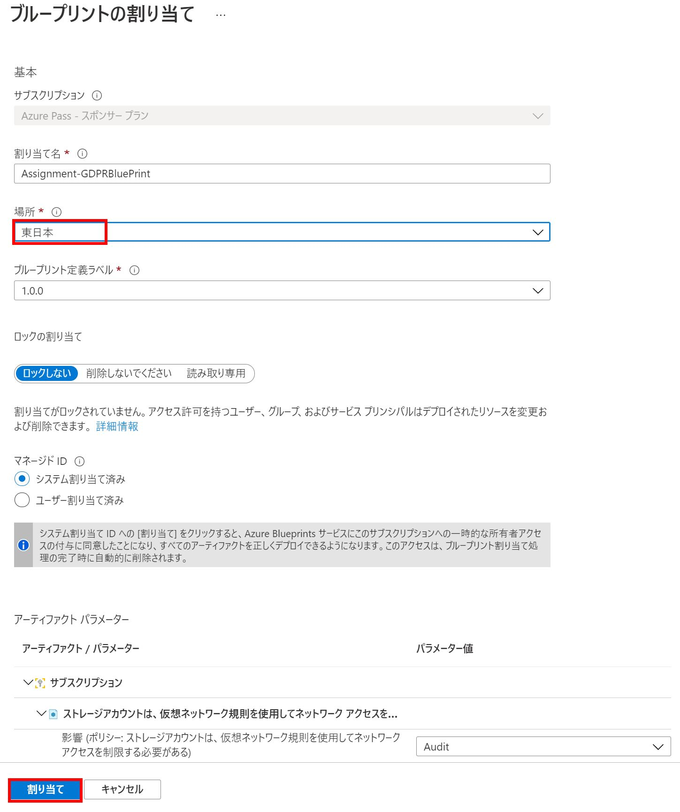

### Task 3: セキュア スコア

1. Azureポータルで「**すべてのサービス**」を選択し、「**セキュリティ**」と入力して「**セキュリティ センター**」を選択します。

2. セキュリティ センター ブレードで、**クラウド セキュリティ** の下の **セキュア スコア** を選択します。

3. 総合的なセキュアスコアの値を確認してください。

    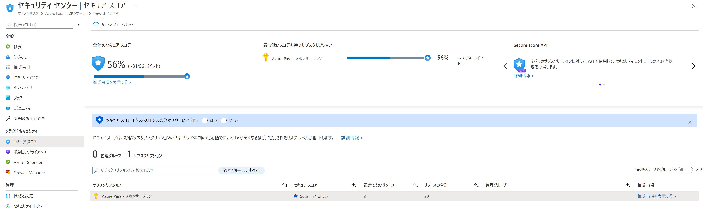

4. ウィンドウの下半分でサブスクリプションを選択すると、リソース検証に失敗したアイテムが、その特定のレコメンデーションアイテムに割り当てられているスコア値でソートされて表示されます。

    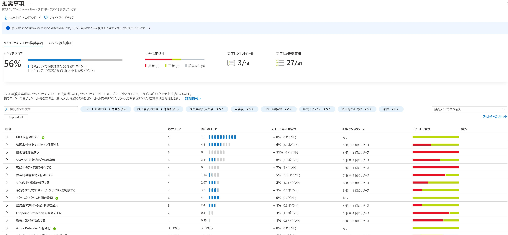

5. **すべての推奨事項** タブを選択し、 **SQL Server に対して Azure Active Directory の管理者をプロビジョニングする必要があります** を選択すると、スコアに影響を与えるための推奨事項の修正方法に関する情報が表示されます。

    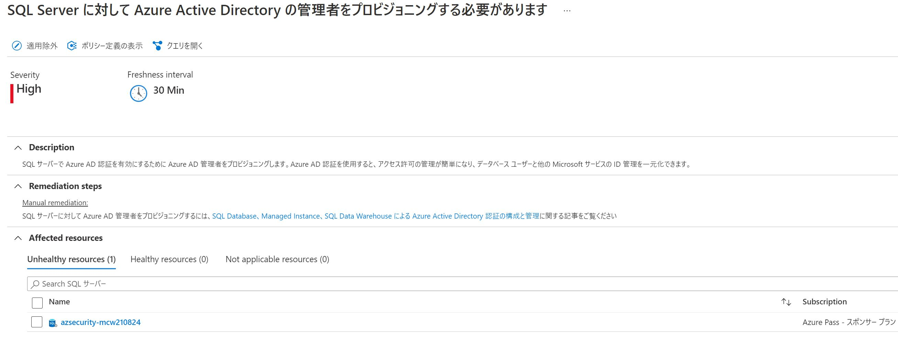


---
以上でハンズオンの内容はすべて終了です。お疲れさまでした。

---
## ハンズオンラボの終了後

Duration: 10 minutes

このセクションでは、ラボのサポートのために作成されたAzureリソースのプロビジョニングを解除します。

### Task 1: リソースグループの削除

1. Azure ポータルを使用して、メニューから  **リソースグループ** を選択して、このハンズオンラボで使用したリソースグループに移動します。

2. 研究グループの名前を検索して、リストから選択します。

3. コマンドバーで **削除** を選択し、リソースグループ名を再度入力して **削除** を選択して削除を確認します。
T
4. Exercise 3 の Task 3 で作成した Azure Key Vault アプリケーションの削除を忘れないでください。

### Task 2: Azure Defender Pricingの削除

1. Azure Securityの Defenderの価格設定を「**オフ**」に戻してください。


---
---
Information in this document, including URL and other Internet Web site references, is subject to change without notice. Unless otherwise noted, the example companies, organizations, products, domain names, e-mail addresses, logos, people, places, and events depicted herein are fictitious, and no association with any real company, organization, product, domain name, e-mail address, logo, person, place or event is intended or should be inferred. Complying with all applicable copyright laws is the responsibility of the user. Without limiting the rights under copyright, no part of this document may be reproduced, stored in or introduced into a retrieval system, or transmitted in any form or by any means (electronic, mechanical, photocopying, recording, or otherwise), or for any purpose, without the express written permission of Microsoft Corporation.

Microsoft may have patents, patent applications, trademarks, copyrights, or other intellectual property rights covering subject matter in this document. Except as expressly provided in any written license agreement from Microsoft, the furnishing of this document does not give you any license to these patents, trademarks, copyrights, or other intellectual property.

The names of manufacturers, products, or URLs are provided for informational purposes only, and Microsoft makes no representations and warranties, either expressed, implied, or statutory, regarding these manufacturers or the use of the products with any Microsoft technologies. The inclusion of a manufacturer or product does not imply endorsement of Microsoft of the manufacturer or product. Links may be provided to third-party sites. Such sites are not under the control of Microsoft and Microsoft is not responsible for the contents of any linked site or any link contained in a linked site, or any changes or updates to such sites. Microsoft is not responsible for webcasting or any other form of transmission received from any linked site. Microsoft is providing these links to you only as a convenience, and the inclusion of any link does not imply endorsement of Microsoft of the site or the products contained therein.

© 2020 Microsoft Corporation. All rights reserved.

Microsoft and the trademarks listed at <https://www.microsoft.com/en-us/legal/intellectualproperty/Trademarks/Usage/General.aspx> are trademarks of the Microsoft group of companies. All other trademarks are the property of their respective owners.
